# Usar Cloudfront en nuestra web estática de S3 y añadirle un certificado con ACM
Para mejorar el rendimiento y la seguridad de la web estática, vamos a incorporarle Cloudfront, que principalmente servirá de caché para que las imágenes (por ejemplo) no tengan que descargarse cada vez que visitemos la página, ahorrando descargas del S3 y haciendo una experiencia de usuario más fluida. 

??? note "Observación"
    Haciendo este proyecto, me he dado cuenta de que es más eficiente hacer primero el certificado en ACM y luego configurar Cloudfront. Ya que a la hora de configurar Cloudfront vamos a poder hacer los cambios necesarios para aplicar el certificado. De la otra manera, es como lo muestro aquí paso a paso. Así que para la próxima vez, aconsejo hacer primero el certificado y luego el Cloudfront, no hay problema alguno haciéndolo como lo hago aquí, a la vista está que funciona, pero de la otra manera es más rápido y cómodo, además de que es menos probable cometer algún error en la configuración.

### Creando la distribución
Vamos a Cloudfront en la consola de AWS y nos saldrán las distribuciones, ahí podremos crear una nueva. 

!!! warning "¡Importante!"
    Cambia la región a Norte de Virginia (us-east-1) y crealo ahí, de lo contrario no podrás crear el registro A en el Route 53.

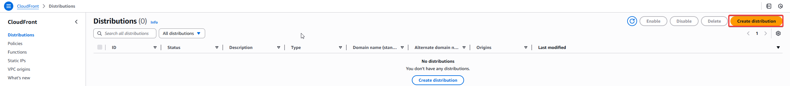

Nada más empezar, tendremos que escoger la opción para la distribución. Esto se basa en el tipo de servicio que usamos en nuestro S3, así que vamos a elegir "Sigle website", ya que nuestro S3 es una web estática.

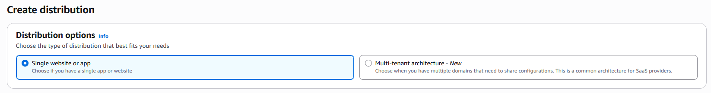

Justo abajo tenemos el origen, aquí es donde tenemos que especificar el origen de la distribución, así que tenemos que buscar nuestro bucket de S3 y seleccionarlo. Como lo [tenemos configurado como una web estática](paginaestaticas3.md) nos saldrá una burbuja en la que se detecta que está configurado de esa manera, así que nos saldrá un botón "Use website endpoint". Le damos a ese botón, ya que así nos hará alguna configuración automática orientada a este caso, un S3 con web estática.

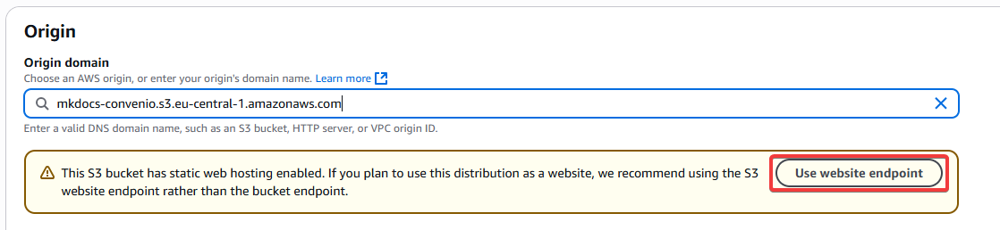

Al darle, vemos que aparecerá el protocolo HTTP y su puerto directamente, tal y como lo tenemos configurado en nuestro S3. Lo dejamos tal y como nos lo deja AWS.

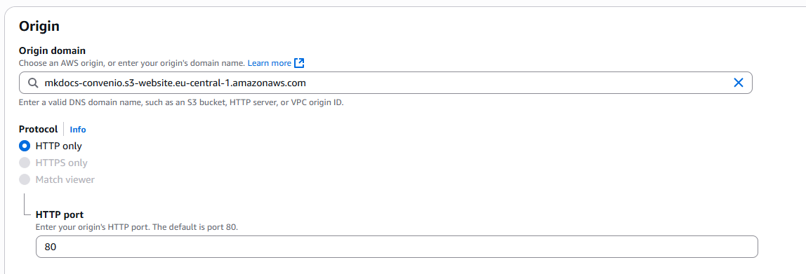

Como he dicho antes, una de las funciones principales de Cloudfront es servir como caché. Aquí vemos las opciones de comportamiento que se le pueden configurar al caché. Hay configuraciones preestablecidas, en mi caso usé el default y no toqué nada. Se puede elegir si comprimir objetos automáticamente, lo cual es recomendable para hacer las descargas de los usuarios más rápidas, el protocolo, los métodos HTTP... lo dejamos todo tal y como está ya que es lo más óptimo. 

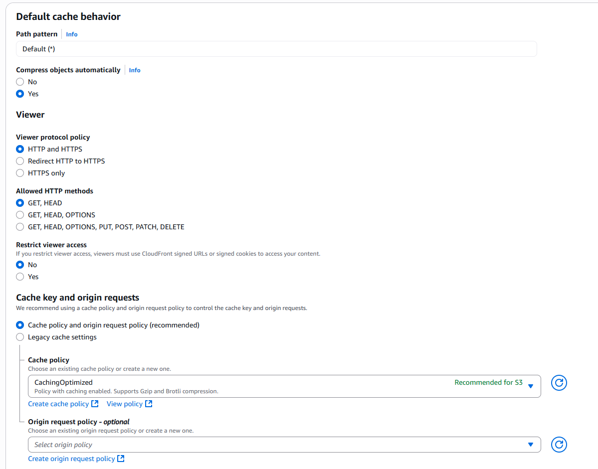

El resto de opciones no las he tocado para este caso concreto, así que lo único que cambié fue en cuanto al WAF. Ahora mismo, no vamos a usar los servicios de WAF, así que le damos a que no habilite las protecciones de seguridad. Esto se configurará más adelante de manera más detallada. Una vez hecho, revisamos que todo está como queremos y le damos a crear.

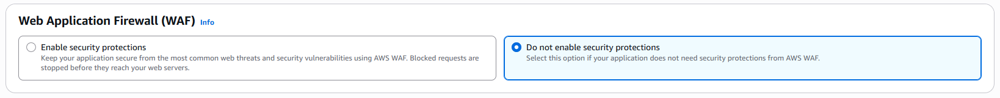

Al darle a crear, nos dirá que se ha creado la nueva distribución.

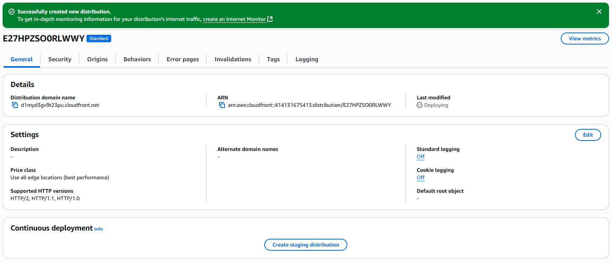

Lo cual es un poco mentira, ya que si nos fijamos en "Last modified" veremos que aún no se ha desplegado. 

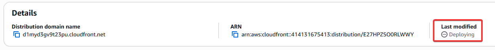

Hasta que eso no cambia, no podemos estar seguros si de verdad está creado correctamente. En este caso, tras unos minutos cambió a la fecha y hora a la que se creó, así que ahora sí que estamos seguros de que está realizado de verdad.

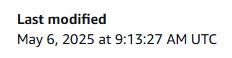

Y para comprobarlo, cogemos el enlace que nos ofrece la distribución y entramos a nuestra web estática a través del propio Cloudfront, y si vemos que nos carga todo, es que realmente está trabajando de verdad.

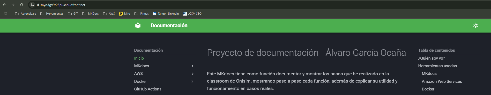

### Solicitar certificado en ACM
Si queremos que nuestra web estática trabaje por HTTPs, vamos a necesitar un certificado. AWS puede dar certificados rápidamente si tenemos un dominio registrado. Para esta práctica usaré un dominio que ya tiene Basetis y crearé un subdominio para mi web. 

!!! warning "¡Importante!"
    Cambia la región a Norte de Virginia (us-east-1) y crealo ahí, de lo contrario no podrás usar el certificado en Cloudfront.

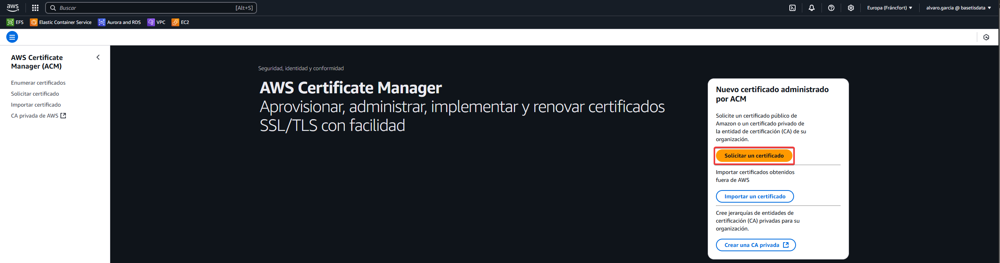

Los pasos son muy sencillos, al darle a solicitar certificado, veremos dos opciones, un certificado público o uno privado. Vamos a seleccionar certificado público, que es realmente lo que necesitamos ya que no tenemos un certificador privado. Le damos a siguiente.

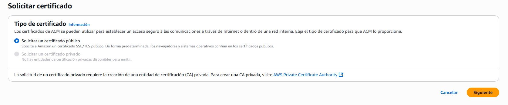

Después, ponemos el FQDN de nuestro dominio. Como he dicho antes, en este caso usaré un dominio de Basetis para ello. Como es un subdominio del dominio, el FQDN (nombre completo) será el que yo quiero, así que le incorporé convenio-docs al inicio de este. El resto de opciones son al gusto, menos la validación de DNS, que es lo recomendado y lo que queremos usar realmente. Le damos a solicitar.

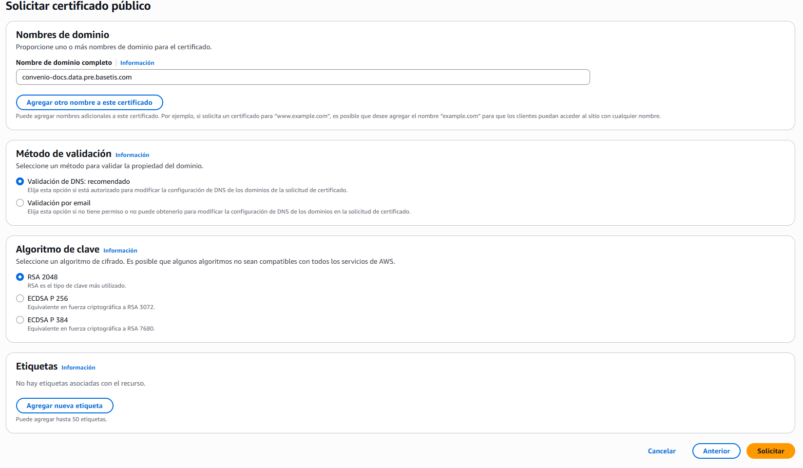

Ya lo hemos solicitado, pero vemos que arriba nos sale un mensaje que nos dice que se necesitan acciones adicionales para completar la validación. AWS no nos dice cuales son las acciones, pero mirando la documentación es porque se necesita un registro en Route 53 para el certificado y el FQDN que le hemos asignado. Así que justo abajo, le damos a crear registros en Route 53.

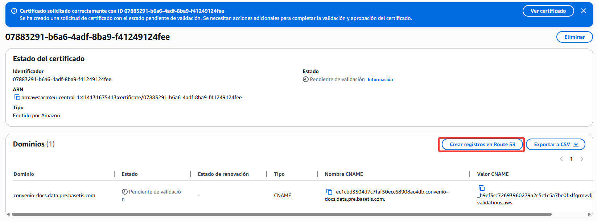

Nos saldrá marcado por defecto el dominio que hemos creado antes, así que le damos a crear registros.

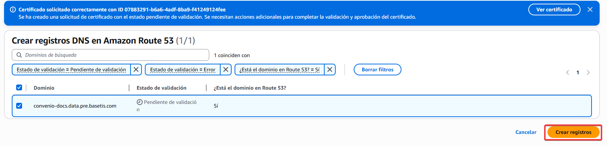

Ahora nos saldrá un mensaje en verde, y ahora sí que realmente está todo hecho.

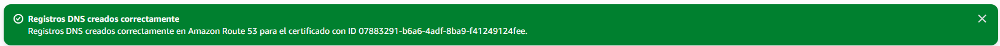

El estado no tardará en cambiar a emitido, por lo que ya tenemos nuestro certificado asignado a nuestro S3.

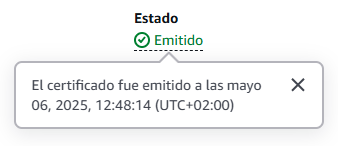

### Asignar certificado a Cloudfront
Ahora tendríamos que hacer algunos cambios a Cloudfront. Si hubiesemos hecho el certificado antes, podríamos habernos ahorrado este paso ya que lo podríamos haber hecho junto con la creación de Cloudfront. 

Vamos a nuestra distribución, y en la pestaña general vamos a editar las settings.

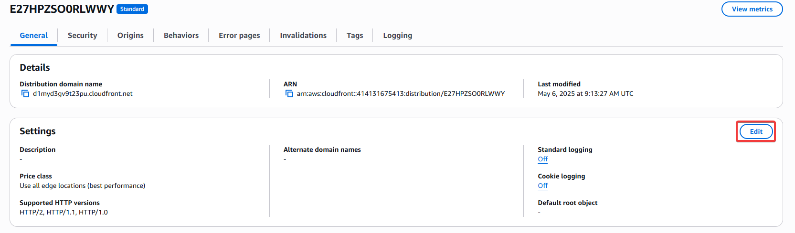

Veremos las opciones que ya vimos en el primer paso, ahora sí que le añadiremos un CNAME alternativo. Este es el CNAME que ya pusimos en el certifcado y que se creó el CNAME en el route 53. 

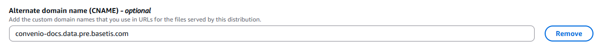

Más abajo, podemos añadir nuestro certificado. Ahí mismo nos indica que solo veremos los certificados creados en us-east-1. Lo seleccionamos y dejamos lo demás por defecto.

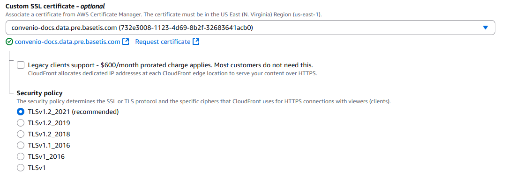

Ahora hay que cambiar el comportamiento de nuestro Cloudfront, ya que ahora mismo también se puede acceder a este desde HTTP. Vamos a la pestaña correspondiente, seleccionamos el behavior que tiene y le damos a editar.

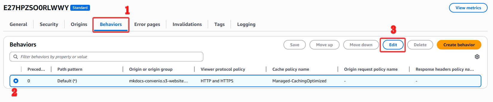

Y cambiamos la política de protocolo a que redirija las entradas HTTP a HTTPS.

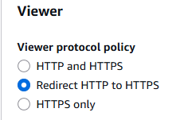

Ahora si entramos desde el enlace del propio cloudfront, vamos a ver si de verdad aparece nuestro certificado y podemos entrar con HTTPS. 

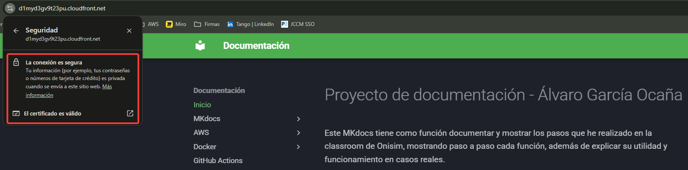

En la URL, vemos que aparece el candado y que el certificado es válido, así que efectivamente funciona el HTTPS, ya que además entrando al enlace directamente ha pasado de HTTP a HTTPS. Ahora solo quedaría entrar con el FQDN que le hemos asignado (En mi caso, convenio-docs.data.pre.basetis.com). Para hacer esto, tenemos que hacer algo más, que es añadir un registro A en el DNS, ya que por ahora solo tenemos un alias del certificado, pero ahora falta indicarle donde están los recursos al DNS.

Vamos a nuestro Route 53 y le creamos un nuevo registro, le ponemos el nombre, seleccionamos tipo de registro A (para IPv4) y luego en dirigir el tráfico a seleccionamos "Alias de la distribución de CloudFront", ahí nos aparecerá nuestro CloudFront. Le damos a crear registro y con eso será suficiente.

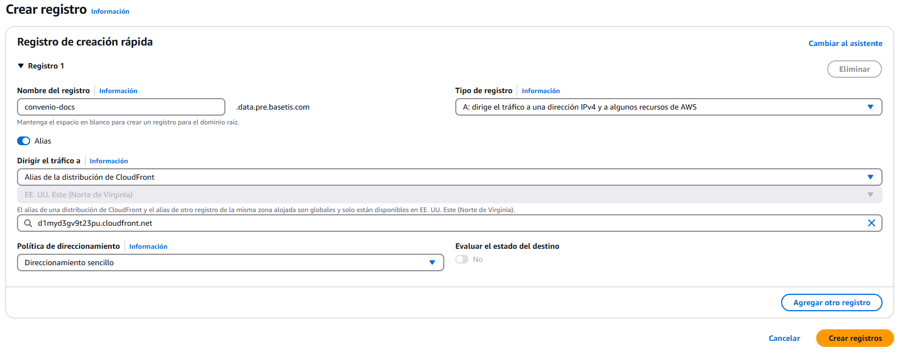

!!! warning "¡Importante!"
    Tuve algunos problemas a la hora de crear el registro, no me salía mi CloudFront a pesar de estar en la región global. El problema era que al crear el registro A yo pensaba que no era necesario que se llamase exactamente igual, pero sí, es totalmente necesario. Así que hay que tenerlo siempre en cuenta, el registro se debe llamar exactamente igual que el CloudFront o ni siquiera aparecerá en la lista desplegable.

Ahora sí que podremos entrar en convenio-docs.data.pre.basetis.com y comprobar que funciona con HTTPS y que tiene un certificado verificado.

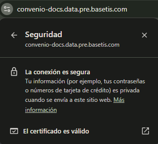
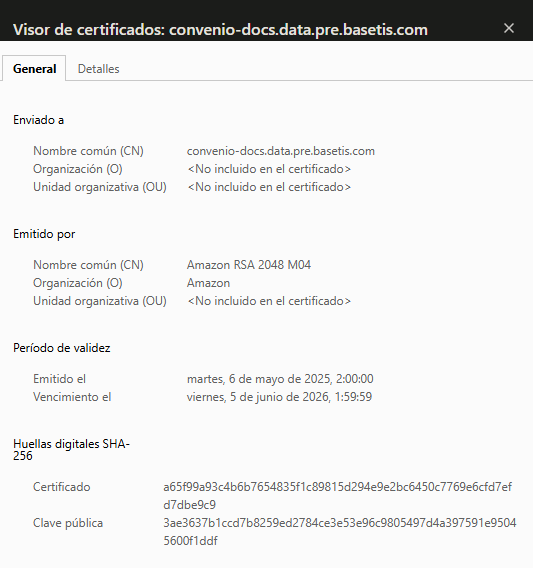

Listo. Ahora, como extra, si tienes automatizado todo con GitHub actions hay que hacerle un cambio a la pipeline.

[:tools: Actualizar GitHub Actions para tener en cuenta el CloudFront :tools:](GitHubActions.md#extra-actualizar-pipeline-para-cloudfront){ .md-button }