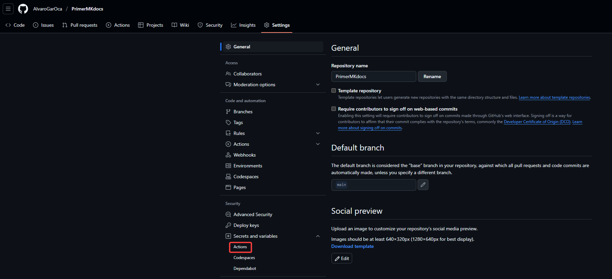
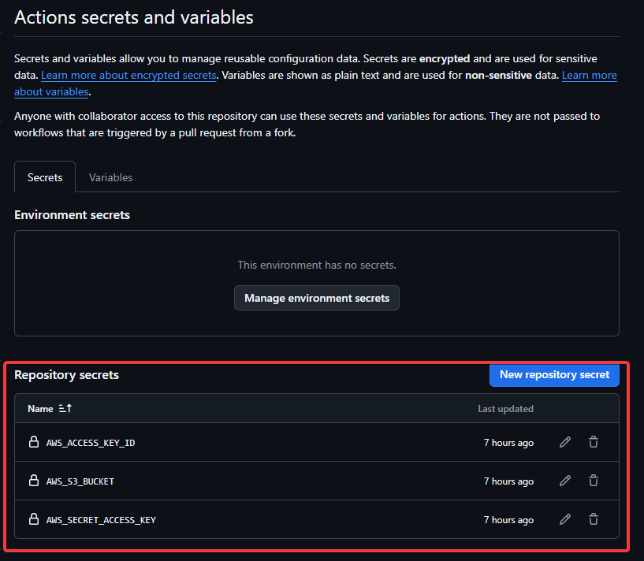
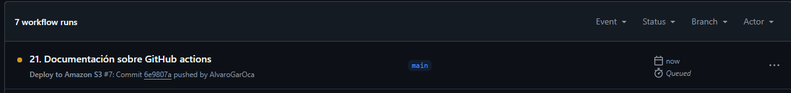
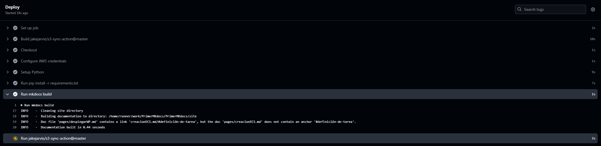
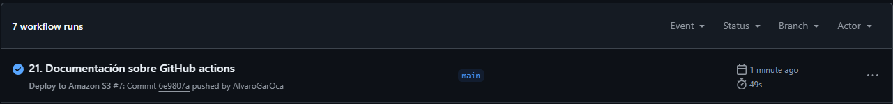
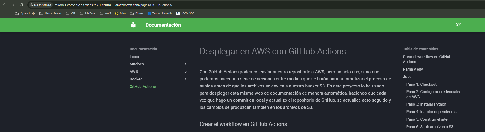
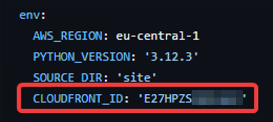
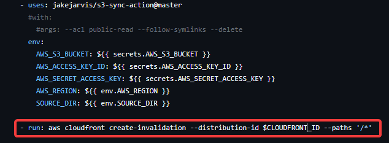
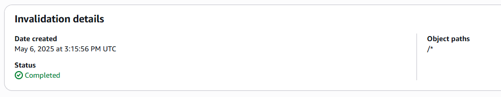

# Desplegar en AWS con GitHub Actions
Con GitHub Actions podemos enviar nuestro repositorio a AWS, pero no solo eso, si no que podemos hacer una serie de acciones entre medias que se harán para automatizar el proceso de subida antes de que los archivos se envien a nuestro bucket S3. En este proyecto lo he usado para desplegar esta misma web de documentación de manera automática, haciendo que cada vez que hago un commit en local y actualizo el repositorio de GitHub, se actualice acto seguido y los cambios se produzcan también en los archivos de S3.

### Crear el workflow en GitHub Actions
En GitHub debemos tener un archivo que determinará el workflow del repositorio. Si le damos a crear un nuevo Workflow en la parte de Actions de nuestro repositorio se creará automáticamente tras escoger una acción que nos interese. Aunque también podemos crear el archivo manualmente y subirlo al repositorio. Para este proyecto, este es el archivo que he usado:

??? example "Archivo yml completo"
    ```bash
    name: Deploy to Amazon S3
    
    on:
        push:
            branches: [ "main" ]

    env:
        AWS_REGION: eu-central-1
        PYTHON_VERSION: '3.12.3'
        SOURCE_DIR: 'site'
  
    permissions:
        contents: read

    jobs:
        deploy:
            name: Deploy
            runs-on: ubuntu-latest
            environment: production

        steps:
        - name: Checkout
          uses: actions/checkout@v4

        - name: Configure AWS credentials
          uses: aws-actions/configure-aws-credentials@v1
          with:
            aws-access-key-id: ${{ secrets.AWS_ACCESS_KEY_ID }}
            aws-secret-access-key: ${{ secrets.AWS_SECRET_ACCESS_KEY }}
            aws-region: ${{ env.AWS_REGION }}

        - name: Setup Python
          uses: actions/setup-python@v5.6.0
          with:
            # Version range or exact version of Python or PyPy to use, using SemVer's version range syntax. Reads from .python-version if unset.
            python-version: ${{ env.PYTHON_VERSION }}

        - run: pip install -r requirements.txt
        - run: mkdocs build
        - uses: jakejarvis/s3-sync-action@master
          #with:
            #args: --acl public-read --follow-symlinks --delete
          env:
            AWS_S3_BUCKET: ${{ secrets.AWS_S3_BUCKET }}
            AWS_ACCESS_KEY_ID: ${{ secrets.AWS_ACCESS_KEY_ID }}
            AWS_SECRET_ACCESS_KEY: ${{ secrets.AWS_SECRET_ACCESS_KEY }}
            AWS_REGION: ${{ env.AWS_REGION }} 
            SOURCE_DIR: ${{ env.SOURCE_DIR }}     
    ```
Veamos cada parte con detenimiento.

### Rama y env
```bash
    name: Deploy to Amazon S3

    on:
        push:
            branches: [ "main" ]

    env:
        AWS_REGION: eu-central-1
        PYTHON_VERSION: '3.12.3'
        SOURCE_DIR: 'site'

    permissions:
        contents: read
```

Lo primero que vemos en el archivo yml, es el nombre que tiene la acción, que es simplemente eso. Lo importante empieza después, con las opciones "ON, PUSH, BRANCHES" quiere decir que se ejecutará la acción cada vez que haya una acción en la rama main de nuestro repositorio. Por lo que cada vez que hagamos una actualización de este desde local, se ejecutarán los siguientes pasos.

En cuanto al entorno, se refiere a las variables que usará la acción que le vamos a dar a la action que usaremos. Para ello, vamos a usar AWS, así que necesitamos la región en la que trabajamos, se la ponemos. Como MkDocs trabaja con Python, vamos a necesitar instalarlo en la máquina temporal de GiTHub que hará todo lo demás para hacer el build. El caso es que necesitamos la versión de Python, usaremos la versión que estamos usando en local para que sea exactamente lo mismo. Por último le decimos el nombre del directorio que queremos desplegar en el S3, al hacer el build se creará la carpeta 'site', que es la que queremos subir al S3.

Los permisos que tendrá la acción serán de lectura, así que no afectarán a nuestro repositorio como tal.

### Jobs
Los jobs son las instrucciones que tendrá la acción, que además albergan los pasos. El job principal será el de deploy, ya que vamos a desplegar la página estática en el S3, como ya sabemos. 

```bash
    jobs:
        deploy:
            name: Deploy
            runs-on: ubuntu-latest
            environment: production
```

Le ponemos el nombre al job, y luego le decimos en qué tipo de máquina queremos hacer el job. Como ya he mencionado anteriormente, las acciones se harán en una máquina temporal que nos ofrece GitHub gratuitamente (a los repositorios públicos, si tu repositorio es privado hay que pagar). Le especificamos que use la última versión de ubuntu para el job. Por último el environment, le ponemos producción aunque esto ahora es irrelevante en este caso, es una buena práctica.

#### Paso 1: Checkout
```bash
        steps:
        - name: Checkout
          uses: actions/checkout@v4
```
El primer paso es la acción oficial que nos ofrece GitHub, checkout. Esta acción lo que hace es clonar el repositorio en la máquina temporal que hará todos los pasos, la que hemos definido antes. Necesitará todo el repositorio, ya que usará tanto el mkdocs.yml como el requirements también, además de obviamente el resto de archivos.

#### Paso 2: Configurar credenciales de AWS

```bash
    - name: Configure AWS credentials
        uses: aws-actions/configure-aws-credentials@v1
        with:
            aws-access-key-id: ${{ secrets.AWS_ACCESS_KEY_ID }}
            aws-secret-access-key: ${{ secrets.AWS_SECRET_ACCESS_KEY }}
            aws-region: ${{ env.AWS_REGION }}
```
Lo siguiente es referente a las credenciales de nuestra cuenta de AWS. Vamos a usar tanto la región como las credenciales con GitHub Secrets para mayor seguridad. Esto lo que hará será ir a los secretos que tenemos y coger las variables que tenemos allí, lo que permitirá que nunca se puedan ver ni el usuario ni la contraseña en el workflow. Esto es muy buena práctica de seguridad, ya que no es la mejor idea del mundo poner nuestras contraseñas en un repositorio público. 

Para crear nuestros secretos, tenemos que entrar en las opciones de nuestro repositorio y luego vamos a secretos y variables. Ahí creamos los secretos con las variables que vayamos a poner en el yml del workflow, asegurándonos de que es exactamente igual.




#### Paso 3: Instalar Python
```bash
    - name: Setup Python
    uses: actions/setup-python@v5.6.0
    with:
        python-version: ${{ env.PYTHON_VERSION }}
```

Ahora, la máquina temporal de GitHub instalará Python directamente. Como vemos, la versión elegida es la que establecimos al principio en env, la variable. No tiene más este paso, usará la acción oficial de GitHub para la instalación y lo hará automáticamente.

#### Paso 4: Instalar dependencias
```bash
- run: pip install -r requirements.txt
```

Como ya sabemos a la hora de instalar MkDocs, necesitamos unas dependencias que serán necesarias para hacerlo funcional, como el propio mkdocs, o extensiones de este. Tenemos el archivo txt directamente en el repositorio, y como lo hemos copiado en el runner (la máquina temporal) y además hemos instalado Python, ahora podemos decirle que con un comando bash instale lo que hace en ese archivo con pip.

#### Paso 5: Construir el site
```bash
- run: mkdocs build
```

Este comando es muy sencillo. Ya tenemos instaladas las dependencias, así que ahora construirá el site, que es lo que se subirá a S3. Como vemos, cada paso necesita al anterior, así que es muy importante el orden siempre.

#### Paso 6: Subir archivos a S3
```bash
    - uses: jakejarvis/s3-sync-action@master
    env:
        AWS_S3_BUCKET: ${{ secrets.AWS_S3_BUCKET }}
        AWS_ACCESS_KEY_ID: ${{ secrets.AWS_ACCESS_KEY_ID }}
        AWS_SECRET_ACCESS_KEY: ${{ secrets.AWS_SECRET_ACCESS_KEY }}
        AWS_REGION: ${{ env.AWS_REGION }} 
        SOURCE_DIR: ${{ env.SOURCE_DIR }}
```
Por último, subirá el site a nuestro bucket S3. Usará una acción de "jakejarvis", esta es una acción que he encontrado en el workshop de actions. Como se puede ver, simplemente hay que pasarle todas las variables que tenemos, o casi todas. Usa todas las variables de nuestro secrets, que además de las credenciales también le decimos el bucket al que queremos que se suba de esa cuenta. Por último la región y ya, el source_dir, es decir el site, nuestra web compilada.

### Comprobación
Ahora solo falta comprobar si de verdad todo esto funciona. Para comprobarlo, debemos recordar como se inicia la acción, con un push en la rama main, así que eso es lo que hacemos. Una vez hecho, si vamos inmediatamente a la sección de acciones del repositorio, veremos que aparece en el workflow el commit que acabamos de hacer. Con un punto naranja a la izquierda quiere decir que está "en cola".



Si entramos ahí, podemos ver cómo se va ejecutando en el runner paso a paso que le hemos dicho en el yml. Es muy útil verlo para ver si todo funciona correctamente, y si hay algún error, nos lo dirá aquí directamente. El error que pueda aparecer, será en el paso exacto, así que será fácil identificarlo. En este caso, parece que todo va bien:



No tardará mucho, pero en esa misma página veremos que el job está hecho y el workflow ha ido correctamente. Si vamos atrás, ahora veremos que el commit sale con un tick azul como que todo ha salido bien y se han completado todos los pasos del job.



Ahora solo queda acceder a nuestra URL pública de nuestro S3, y ver los cambios que se han hecho en la web pública.



Y ya está, ahora cada vez que hagamos un push a nuestro repositorio, la página web que está en internet se actualizará en cuestión de segundos con el nuevo contenido.

### Extra: Actualizar pipeline para CloudFront
Si tenemos un CloudFront en nuestro S3, [tal y como hemos hecho aquí](Cloudfront.md), vamos a necesitar tenerlo en cuenta. CloudFront sirve como caché, así que todo lo que se use se guardará en CloudFront para no tener que estar haciendo peticiones constantemente al bucket S3, lo que mejora el rendimiento y la seguridad. Pero entonces, cuando nosotros hagamos un push y se actualice el contenido del S3, es posible que se tarde demasiado o que ni siquiera se actualice la web para algunos clientes, ya que toda la web está cacheada y no es necesario hacer peticiones a S3. Para solventar este problema, lo que haremos será borrar el caché entero de nuestro CloudFront cada vez que se agreguen nuevos contenidos a la página web. 

Para ello, es muy sencillo. Tenemos que añadir una nueva variable, que es el ID de nuestro CloudFront.



Y por último, vamos a hacer un run del siguiente comando del CLI de AWS. Este comando lo que hace es indicarle a nuestra distribución que se limpiarán todos los datos desde el raíz y que empezará a cachear después de esta limpieza. 



Si vamos a nuestra distribución, en la pestaña de "Invalidations" veremos que ha salido un registro nuevo después de ejecutar la pipeline del actions. Como se puede ver, además de la fecha y de que se ha completado, se ve el "Object paths", que básicamente nos indica que borra todo desde el raíz (/*). Con esto, está arreglado el problema y nuestro automatismo irá perfectamente de nuevo.

