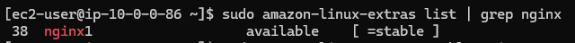
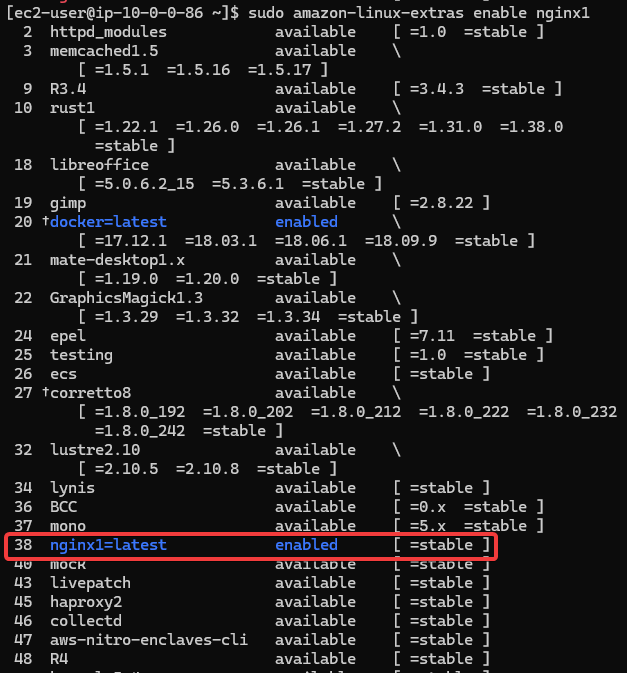
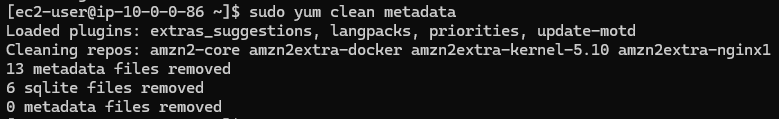
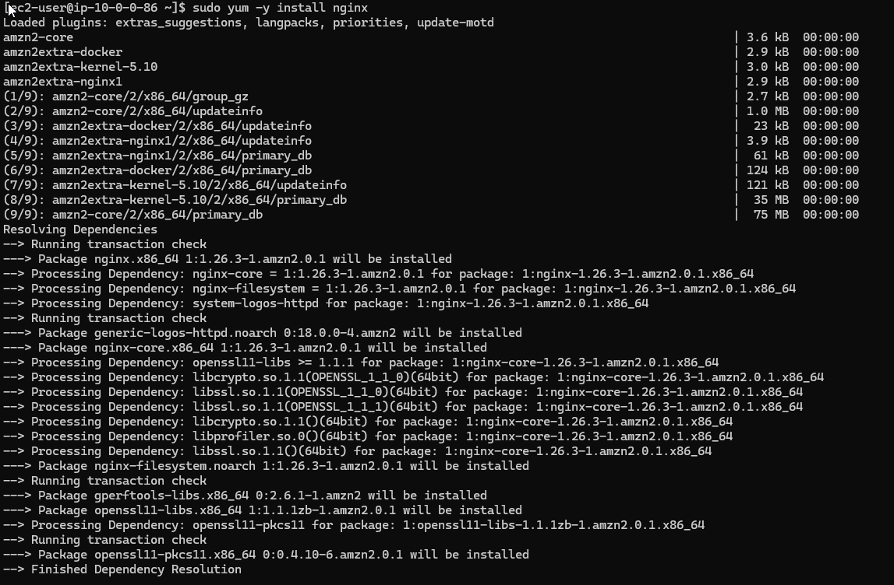
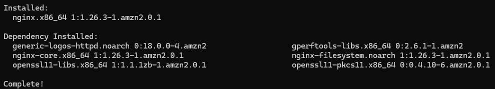
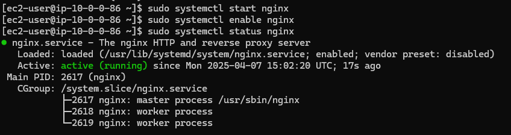
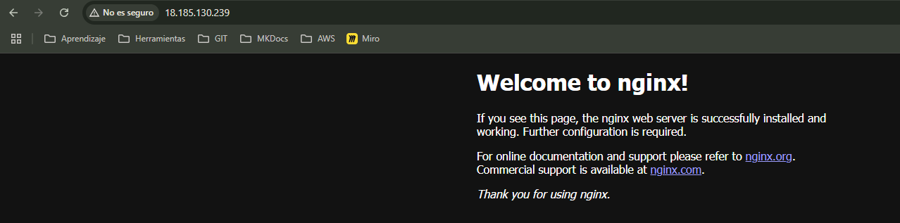

# Instalación de :simple-nginx: Nginx en la máquina EC2

Ya tenemos nuestra máquina funcionando, ahora necesitamos un servicio instalado en ella. Para este ejemplo, siguiendo los ejercicios de mi tutor, vamos a instalar un Nginx en la máquina que creamos [anteriormente](instalacionEC2.md).

A través de SSH, tenemos que hacer una serie de comandos para llevar a cabo la instalación. Al igual que otros muchos programas o servicios, esto se hace de la misma manera, teniendo en cuenta que es un Amazon Linux 2. Teniendo en cuenta que ya estamos conectados a nuestra máquina, vamos a comprobar si está disponible para instalar directamente en la máquina.



??? example "Comando"

    ``` bash
    sudo amazon-linux-extras list | grep nginx
    ```

Vemos que está disponible, así que vamos a habilitarlo para poder iniciar con la instalación. 



??? example "Comando"

    ``` bash
    sudo amazon-linux-extras enable nginx1
    ```

El comando nos indicará al final qué pasos debemos seguir una vez hecho esto. Lo primero que nos indica es que debemos hacer una limpieza de metadatos de los repositorios para instalar Nginx. Así que ejecutamos este comando:



??? example "Comando"

    ``` bash
    sudo yum clean metadata
    ```

Ahora que tenemos el terreno listo y preparado, vamos a instalar Nginx. Muy sencillo, usamos el repositorio yum también para instalarlo con el siguiente comando:



??? example "Comando"

    ``` bash
    sudo yum -y install nginx
    ```

Al final veremos lo instalado, tanto Nginx como sus dependencias.



Para asegurarnos, vamos a hacer una serie de comandos, ya que lo normal es que tras una instalación no se active por si solo un servicio. Hacemos por orden los comandos mostrados en la captura.



??? example "Comandos"

    ``` bash
    sudo systemctl start nginx
    sudo systemctl enable nginx
    sudo systemctl status nginx
    ```

Y con esto está instalado y preparado. Pero la máquina aún necesita algo más, ya que viene configurado con su firewall para evitar que se conecten directamente. Para hacer una excepción, añadimos una iptable nueva donde aceptaremos conexiones HTTP por el puerto 80.


??? example "Comando"

    ``` bash
    sudo iptables -I INPUT -p tcp --dport 80 -j ACCEPT
    ```

Y ahora sí, ya podemos usar nuestro Nginx. Para comprobar que la conexión a la máquina va bien, vamos a nuestro navegador y conectamos por HTTP a la máquina, introduciendo su IP pública.



¡Hecho!