# Puesta en marcha de Nginx en un EC2

Ya tenemos un [EC2 en funcionamiento](instalacionEC2.md) y [Nginx instalado](Nginx.md). Ahora es el momento de subir los archivos y configurarlo para que nos muestre nuestra web estática.

??? note "¿Qué es Nginx?"

    Nginx es un servidor web que también puede servir de proxy inverso. Es conocido por su eficiencia, velocidad y capacidad para manejar mucho tráfico simultáneo. Es perfecto para server archivos estáticos como un MKdocs.

### Subir los archivos al EC2

Lo primero es compilar nuestro sitio web. En mi caso lo haré con mi propio proyecto de MKdocs, este mismo. Al ser un MKdocs, este tiene un comando fácil para compilar la web, que es el siguiente:

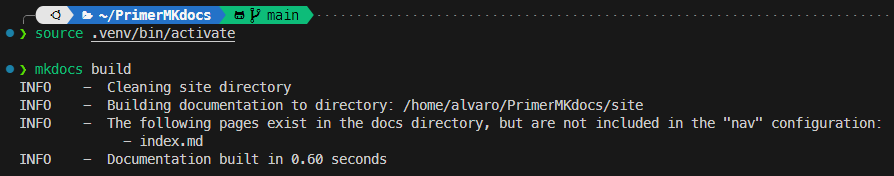

??? example "Comando"

    ``` bash
    mkdocs build
    ```

Ahora que lo tenemos compilado, tenemos que subir los archivos a nuestro EC2. Para ello, vamos a hacerlo con ==scp==. ¿Qué pasa si lo hacemos directamente?

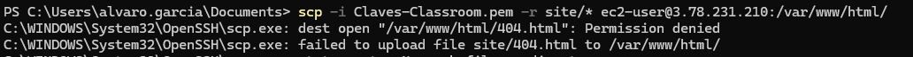

!!! failure "Primer problema"
    Al hacer directamente la copia de los archivos desde nuestra máquina local al EC2, vemos que tenemos permiso denegado a la carpeta. Para solucionarlo, tenemos que entrar por SSH como ya vimos [anteriormente](instalacionEC2.md#conexion-a-la-ec2)

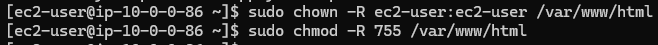

??? example "Comandos para dar los permisos que he usado"

    Para hacer al usuario de nuestra EC2 el dueño de la carpeta que contendrá nuestra web:
    ``` bash
    sudo chown -R ec2-user:ec2-user /var/www/html
    ```
    Para darle todos los permisos al owner:
    ```
    sudo chmod -R 755 /var/www/html
    ```

Ahora si volvemos a intentarlo, vemos que sí que podremos subir los archivos:

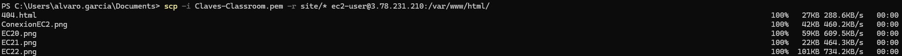

¡Ya tenemos nuestros archivos en nuestra EC2!

### Configuración y comprobación

Lo siguiente sería configurar Nginx para que la página por defecto sea la nuestra en vez de la que viene de base. Para ello, dentro de nuestra máquina EC2, buscaremos el archivo /etc/nginx/nginx.conf

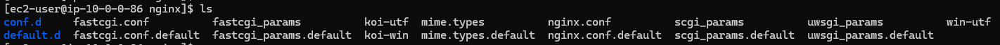

Una vez localizado, lo configuramos con nuestro editor de confianza, en mi caso con nano. Debemos incorporar lo marcado en la captura, que es la ruta de donde cogerá los archivos, y el index indicado.

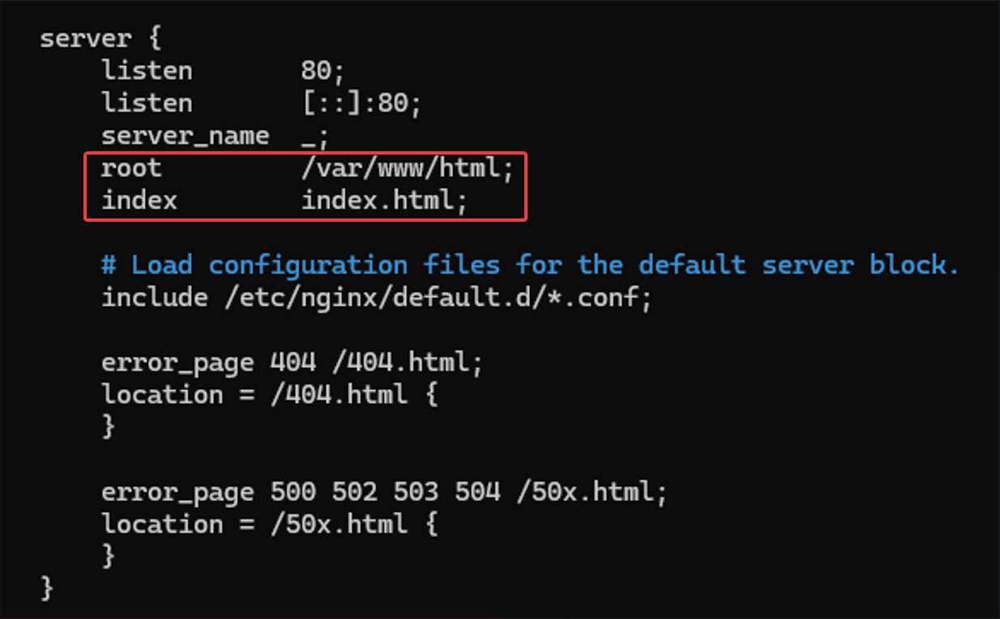

¡Ya está! Ahora vamos a ver cómo se ve nuestro sitio desde Nginx, alojado en nuestra EC2 :smile:

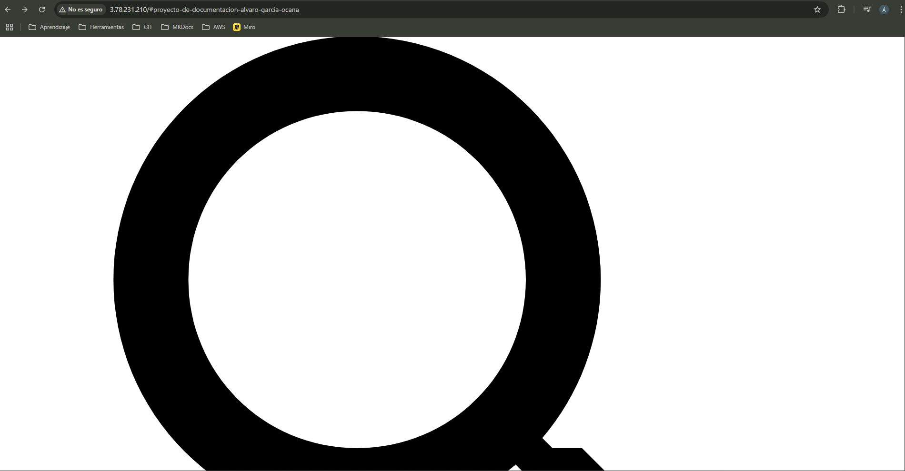
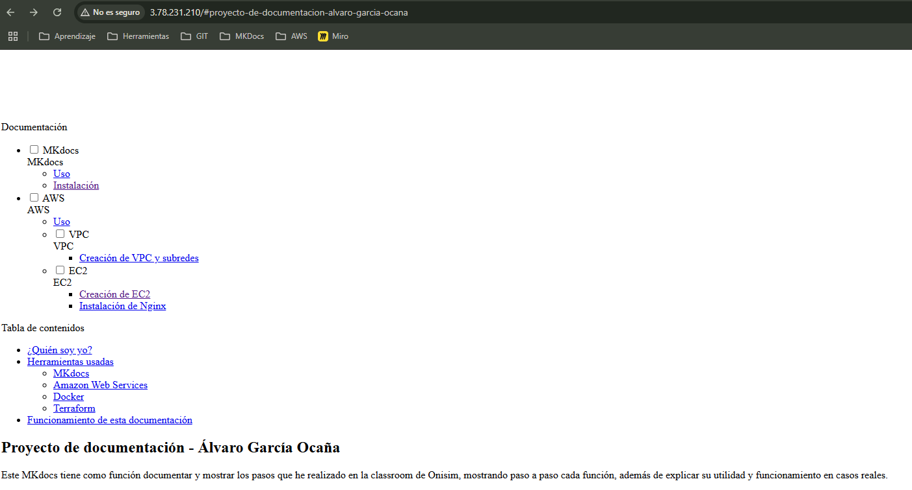

:fearful:

En mi caso, no funcionó exactamente como debería, como se puede ver el contenido está ahí pero por alguna razón no se carga el estilo de las páginas. Para arreglarlo, lo primero que hice fue mirar los logs de Nginx.

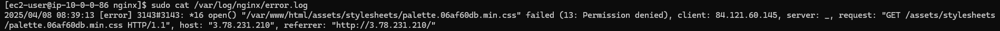

Como se puede ver en el log, por alguna razón se niega el acceso justamente a lo que hace que la página no se vea como debe, los stylesheets. Para arreglarlo, me fijé en qué usuario usaba Nginx para trabajar.

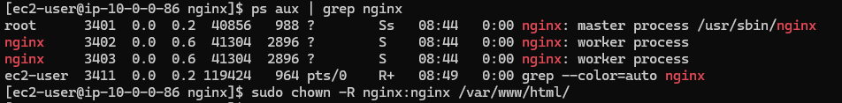

Descubrí que el usuario que usaba, es igual al del servicio, Nginx. Sabiendo esto, y viendo que el problema es que tenía el acceso denegado a esos archivos, hice al usuario de Nginx el propietario de la carpeta que tenía los contenidos de la web.

!!! note "Recuerda"
    Después de cada cambio en el archivo de configuración, o de permisos como es este caso, hay que reiniciar el servicio de Nginx. 

    ```bash
    sudo systemctl restart nginx
    ```

Al hacer este cambio, y volviendo a entrar por el navegador a la IP de nuestra EC2, vemos que ya está activa nuestra web estática, montada con MKdocs, gestionada por un Nginx alojado en una máquina EC2. :material-party-popper::material-party-popper::material-party-popper:

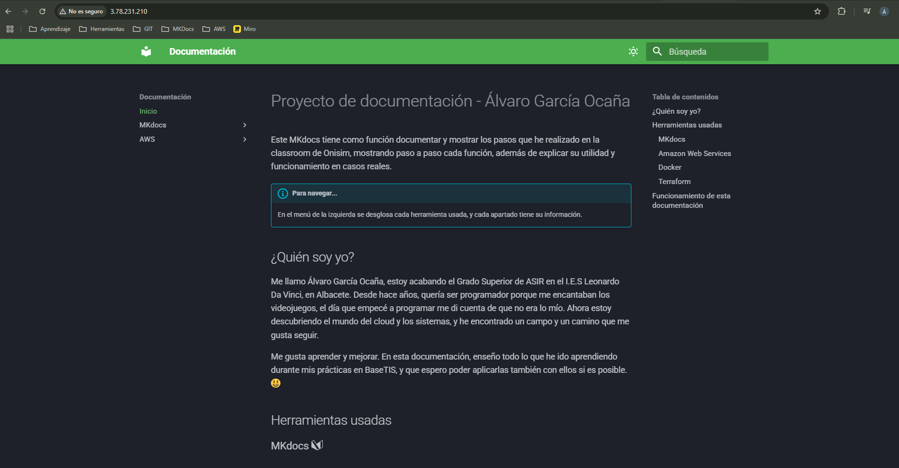