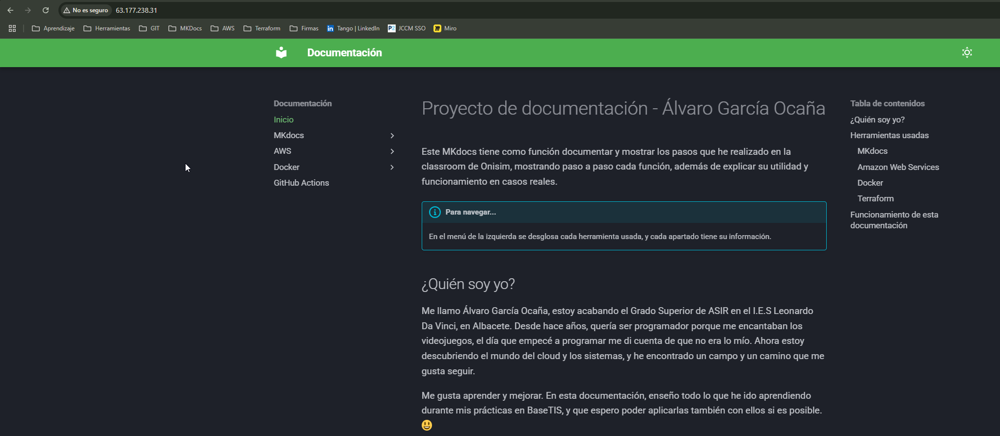

# Terraformar EC2 en una VPC y desplegar web con Nginx
Con Terraform, vamos a desplegar una EC2 que estará en una VPC que tendrá tanto acceso a internet como permitirá la entrada SSH por el puerto 22. Además, en el mismo Terraform, vamos a crear el user_data para poder hacer las instalaciones necesarias. Vamos a ver cómo sería, archivo por archivo y explicando cada configuración tal y como lo he hecho yo para que sea funcional.

### Versions.tf
En el archivo versions vamos a identificar la versión que queremos usar de Terraform, además del proveedor.

Como se puede ver en el código, usamos la versión más reciente (En el momento de esta documentación) de Terraform, permitiendo versiones avanzadas para más adelante sin salir de la 1.11. En required providers, hemos cogido el código que nos da Hashicorp en [este enlace](https://registry.terraform.io/providers/hashicorp/aws/latest) así que no tocamos la versión ya que es la más reciente. 

En provider "aws", debemos poner la región en la que trabajamos como campo obligatorio, luego vienen los tags, que no son estrictamente necesarios.
!!!note "versions.tf"
    ```bash
    terraform {
    required_version = "~> 1.11.0"

    required_providers {
            aws = {
            source  = "hashicorp/aws"
            version = "~> 5.0"
            }
        }
    }

    provider "aws" {
    region = "eu-central-1"
    default_tags {
            tags = {
            Environment = "Prod"
            Owner       = "Álvaro García Ocaña"
            Project     = "Convenio Terraform"
            }
        }
    }
    ```

### Variables.tf
En este archivo realmente he usado muy pocas variables, tan solo dos. La primera es "public_key_location", en la que determino dónde se encuentra mi clave pública para poder entrar por SSH a la máquina EC2 si es necesario. 

La segunda, es "ip_whitelist", también para SSH. En esta variable puedo poner todas las IPs que podrán acceder al SSH, pero como se puede ver no está mi IP ahí ya que está en el archivo terraform.tfvars, el cual solo contiene **"ip_whitelist = ["MIIP/32"]"**. ¿Por qué está separado? Para poder ocultar ese archivo en el gitignore y así nadie podrá ver mi IP cuando lo suba a GitHub. No es necesario hacer esto último si no vas a exponer tu IP al subir tu repositorio en algún sitio público.

!!!note "variables.tf"
    ```bash
    variable "public_key_location" {
    description = "The file path to the SSH public key used for accessing the instances."
    type        = string
    default     = "/home/alvaro/.ssh/id_rsa.pub"
    }

    variable "ip_whitelist" {
    type = list(string)
    }
    ```

### Outputs.tf
En este archivo, solo he puesto algo muy sencillo, y es que saque la IP pública de mi EC2 por comodidad. Así, cuando hagamos el terraform apply nos devolverá la IP pública y podremos acceder directamente a ella a través del navegador. No será necesario entrar a AWS, entrar a EC2 y buscar la IP pública.

!!!note "outputs.tf"
    ```bash
    output "ec2_public_ip" {
        description = "Public IP from my EC2"
        value       = aws_instance.Conv_EC2.public_ip
    }
    ```

### Main.tf
Y por último, el más importante de todos. En este archivo es donde vamos a decirle a Terraform qué es lo que queremos y cómo. Vayamos paso a paso.

#### VPC
Para la VPC, usaremos el módulo oficial que nos ofrece hashicorp, que ya tiene unas configuraciones básicas hechas, nosotros le pondremos lo necesario para nuestro caso concreto. Usando el ejemplo, le vamos a asignar un nombre para identificarlo, luego le especificamos la red en la que trabajará, que en este caso es "10.0.0.0/16", es indiferente. 

Le debemos asignar las azs (Available Zones) en las que podrá actuar nuestra VPC. Le ponemos las zonas de frankfurt, o en la que estemos. Después le asignamos tres IPs, que sería una pública y una privada para cada zona, tres públicas y tres privadas. Con esto ya tenemos la VPC configurada para lanzarla.

!!!note "Módulo de VPC"
    ```bash
    module "vpc" {
    source  = "terraform-aws-modules/vpc/aws"
    version = "5.21.0"

    name = "Conv_VPC"

    # Network
    cidr            = "10.0.0.0/16"
    azs             = ["eu-central-1a", "eu-central-1b", "eu-central-1c"] # Frankfurt
    private_subnets = ["10.0.1.0/24", "10.0.2.0/24", "10.0.3.0/24"]
    public_subnets  = ["10.0.101.0/24", "10.0.102.0/24", "10.0.103.0/24"]
    }
    ```

#### Security Group
Como ya sabemos, necesitamos el security group para poder dar acceso tanto a SSH como a HTTP. Esta vez no usaremos un módulo, así que vamos a usar "resource" para crear el security group. 

Lo más importante de las primeras líneas, es el id del VPC, que lo cogemos del módulo con la línea que se puede ver más abajo. Así no tenemos que preocuparnos por nada, ya que Terraform se encargará de asignarle la ID de la VPC cuando se aplique todo.

Después, sencillamente le indicamos los ingress (entrada) y la egress (salida). Como entrada, dos ingress, uno para HTTP por el puerto 80 para todo internet y otro para SSH tan solo para nuestra variable de ip_whitelist como vimos más arriba. Con esto, todo usuario con el enlace podrá visitar la web por HTTP, pero solo podrán conectar a la máquina EC2 la gente que tenga su IP puesta en el whitelist. Con esto, lo tenemos todo.

!!!note "Security Group"
    ```bash
    resource "aws_security_group" "ec2_sg" {
    name        = "ec2_sg"
    description = "Security group to allow HTTP and SSH access"
    vpc_id      = module.vpc.vpc_id

    ingress {
        description = "HTTP from anywhere"
        from_port   = 80
        to_port     = 80
        protocol    = "tcp"
        cidr_blocks = ["0.0.0.0/0"]
    }

    ingress {
        from_port   = 22
        to_port     = 22
        protocol    = "tcp"
        cidr_blocks = var.ip_whitelist
    }

    egress {
        from_port   = 0
        to_port     = 0
        protocol    = "-1"
        cidr_blocks = ["0.0.0.0/0"]
    }

    tags = {
        Name = "ec2_sg"
    }
    }
    ```
#### Par de claves
Vamos a necesitar nuestro par de claves para poder conectar por SSH a la máquina, así que le tenemos que decir a Terraform dónde tenemos la nuestra. Para eso, vamos a usar la otra variable que hicimos, indicándole previamente que es un archivo. Nada más aquí.

!!!note "Indicamos dónde está nuestra clave pública"
    ```bash
    resource "aws_key_pair" "ssh-key" {
    key_name   = "server-key"
    public_key = file(var.public_key_location)
    }
    ```

#### Imagen para nuestra EC2
Necesitamos una ami para la EC2, así que se lo vamos a indicar con un data. Esto sirve para que Terraform se ponga en contacto con AWS y busque (en este caso concreto, porque se lo decimos así) la versión más reciente de la imagen, que sea de Amazon y una en concreta para nuestra región. Le añadimos unos filtros para hacer la búsqueda más concreta. Esto puede quedar obsoleto con el tiempo, así que tal vez a día que leas esto, esta AMI no sirva y tengas que buscar otra nueva.

!!!note "Buscar la AMI para nuestro EC2"
    ```bash
    data "aws_ami" "latest_amazon_linux_image" {
    most_recent = true
    owners      = ["amazon"]
    filter {
        name   = "name"
        values = ["amzn2-ami-kernel-*-hvm-*-x86_64-gp2"]
    }
    filter {
        name   = "virtualization-type"
        values = ["hvm"]
    }
    }
    ```

#### Instancia EC2
Por último, lo más "complejo" de todo. Vamos a configurar nuestra EC2, paso a paso. 

Primero, le indicamos la AMI, lo que hicimos en el paso anterior, así que referenciamos a la ID del paso anterior. Luego seleccionaremos el tipo de instancia, el par de claves, el security group, la subnet (como si se tratase de un array, le indicamos que queremos por ejemplo la primera IP) y le decimos que queremos asociarle una IP pública, si no, no será accesible por internet.

Segundo, debemos decirle a la EC2 que queremos que haga todo lo que necesitamos con un user_data. Aquí le vamos a añadir las instrucciones por comandos. Repasemos que necesitamos para este caso concreto:

- Instalar Python (Cuidado con la versión, recomiendo la 3.8)
- Instalar Pip
- Instalar git
- Instalar y habilitar Nginx
- Con git, clonamos nuestro repositorio en la máquina.
- Instalamos la dependencias de requirements.txt
- Compilamos la web con Mkdocs build
- Copiamos los archivos ya compilados en la carpeta html de Nginx para mostrar
- Reiniciar el servicio de Nginx para aplicar los cambios

Esto es todo lo que hará nuestro user_data y que dejará listo nuestra web, con la última versión que tengamos subida a GitHub.

!!!note "Instancia de EC2"
    ```bash
    resource "aws_instance" "Conv_EC2" {
    ami = data.aws_ami.latest_amazon_linux_image.id

    instance_type               = "t2.micro"
    key_name                    = aws_key_pair.ssh-key.key_name
    vpc_security_group_ids      = [aws_security_group.ec2_sg.id]
    subnet_id                   = module.vpc.public_subnets[0]
    associate_public_ip_address = true

    user_data = <<-EOF
    #!/bin/bash
        exec > /var/log/user-data.log 2>&1

        # Actualizar el sistema
        yum update -y

        # Habilitar e instalar Python 3.8 (disponible en Amazon Linux Extras)
        amazon-linux-extras enable python3.8
        yum install -y git python3.8

        # Instalar NGINX
        amazon-linux-extras enable nginx1
        yum install -y nginx
        systemctl enable nginx
        systemctl start nginx

        # Instalar pip para la nueva versión de Python
        python3.8 -m ensurepip --upgrade
        python3.8 -m pip install --upgrade pip

        # Clonar el repositorio y preparar el sitio con MkDocs
        cd /tmp
        git clone https://github.com/AlvaroGarOca/PrimerMKdocs.git
        cd PrimerMKdocs
        python3.8 -m pip install -r requirements.txt
        python3.8 -m mkdocs build

        # Copiar el sitio a NGINX
        cp -r site/* /usr/share/nginx/html/

        systemctl restart nginx
                EOF
    }
    ```

### Comprobación
Para comprobarlo, directamente vamos a entrar a nuestra EC2 por http a través del navegador. Recuerda que Terraform te dará la IP pública nada más hacer el apply, como le indicamos en el outputs. **¡Recuerda entrar por http!**



:dancer: ¡Funciona! :dancer: