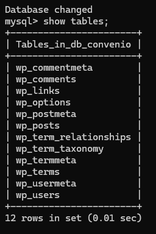

# Conexión con RDS 
Para esta práctica, tengo el RDS que [hicimos aquí](creacionRDS.md), con el clúster que hicimos [en el paso anterior](creacionECS.md).

Para esto, y aprovechando las configuraciones que hicimos en el RDS cuando lo creamos, creamos una definición de tarea nueva con una imagen de Wordpress.

Un poco más abajo, vamos a usar una parte que no hemos visto, que son las variables de entorno. Aquí se pueden integrar variables que usará la imagen automáticamente para configurarse. En este caso, lo usamos para decirle a Wordpress el nombre de la base de datos, el host (que es el RDS), el usuario y la contraseña. 

??? note "Recuerda"
    En la configuración de redes, hay que incorporar la tarea a la VPC que nos interesa. Además, está bien crearle un grupo de seguridad independiente para evitar mezclarlo con otras cosas. No sé si es la mejor práctica, pero yo me estoy aclarando mejor así

En el grupo de seguridad que esté para la tarea, debemos asegurarnos que como regla de salida está puesto para todo el tráfico posible, así podrá conectar con RDS sin problemas. En cuanto al grupo de seguridad de RDS, todo lo contrario, como regla de entrada debemos especificar el grupo de seguridad de la tarea, así podrá conectar exclusivamente el Wordpress que se levanta en el ECS.

Con esto ya está listo. Si entramos a la IP pública del contenedor, vemos que efectivamente se ha levantado el wordpress.

Pero esto no significa que de verdad esté conectado a la base de datos, ya que nos muestra la instalación y nada más. Para asegurarme de que está conectado a la base de datos de RDS, conectamos desde EC2 a la base de datos como ya hicimos en la creación de RDS. La base de datos estaba vacía, pero si entramos desde MySQL a la base de datos y comprobamos la tabla...

Se muestran las tablas que crea automáticamente Wordpress tras la instalación, así que está todo correcto.