# Creación de ECS con Fargate
Con ECS, podemos tener contenedores docker en la nube y desplegarlos fácilmente sin la necesidad de tener que administrar un servidores que los aloje, ya que usaremos Fargate para esto. En este ejemplo, vamos a desplegar una imagen docker de Nginx en ECS, y accederemos a él a través de una IP pública. 

### Crear el clúster de ECS
Para empezar, vamos a crear el clúster. Vamos a Amazon Elastic Container Service (ECS) y le damos a crear clúster.

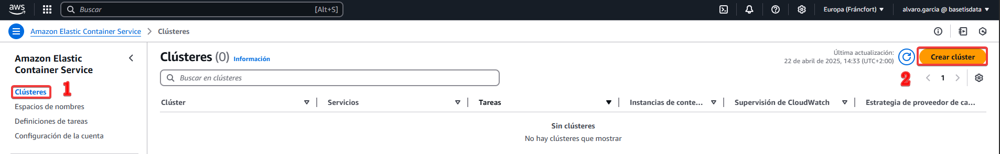

Como he dicho anteriormente, queremos hacer un servicio serverless, así que vamos a usar AWS Fargate. Esto además tiene pago por usos, aunque a diferencia de S3, no quiere decir que el uso sea por tráfico. Aquí, como se ve en el pantallazo, ponemos el nombre y además seleccionamos la infraestructura, Fargate.

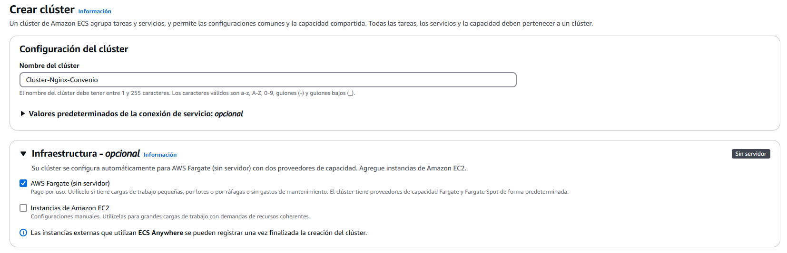

La creación del clúster tiene muchas más opciones. Pero por ahora, esto es todo lo que vamos a tocar. Le damos a crear y veremos que nos aparece esto en pantalla:

No tardará demasiado en crearse, pero con esto, ya tenemos el clúster hecho.

### Definición de tarea

Bien, tenemos el clúster de ECS, pero ahora necesitamos las instrucciones. En la definiciones de tareas, es donde le vamos a decir qué queremos exactamente. Vamos a especificarle que queremos un contenedor docker de Nginx, donde ya está todo preconfigurado, así que usaremos la imagen oficial.

Para empezar, en el menú lateral de ECS, le damos a definiciones de tareas y creamos una nueva. Ahí, le ponemos el nombre...

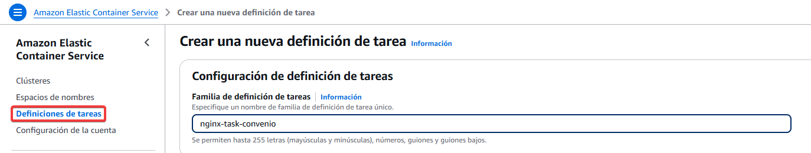

En los requisitos de infraestructura, recordamos que hemos marcado AWS Fargate, así que nos mantenemos así en tipo de lanzamiento. Esto usará su sistema operativo, su CPU, memoria... como si fuese una máquina virtual, pero no podremos crear una configuración de esta, ya que será exclusivamente usada para el servicio que le vamos a asignar. Avanzamos.

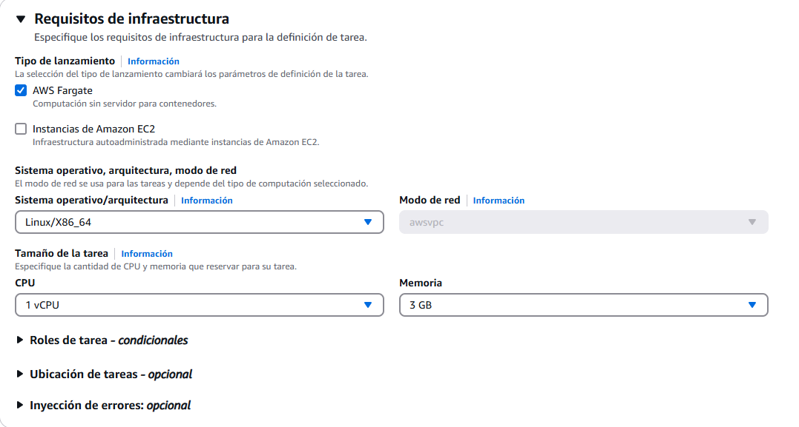

En roles de tarea, lo vamos a dejar por defecto. No lo vamos a usar, pero con estos roles podemos crear un rol en IAM y asignárselo a la tarea. Por ejemplo podríamos usar esto para crear un rol específico en el que la tarea además de levantar el Nginx, se conecte a una base de datos. El rol de ejecución de tareas, lo dejamos tal y como está, ya que es el rol para ejecutar la tarea de manera predeterminada.

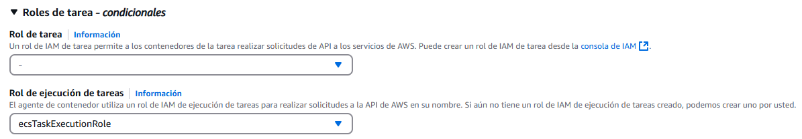

Ahora viene lo más importante de todo, el contenedor. Como se ve en la captura de más abajo, vamos a ponerle un nombre y también especificamos la imagen. Tenemos que buscar una en concreto, o crearla y subirla a docker hub. Yo aquí he usado la oficial de Nginx, en su última versión, para asegurarme de que funciona bien. Abajo se ve el puerto por el que trabaja, como es un Nginx y trabaja por el puerto 80, lo dejamos como muestro. El resto de opciones, no nos interesa por ahora. 

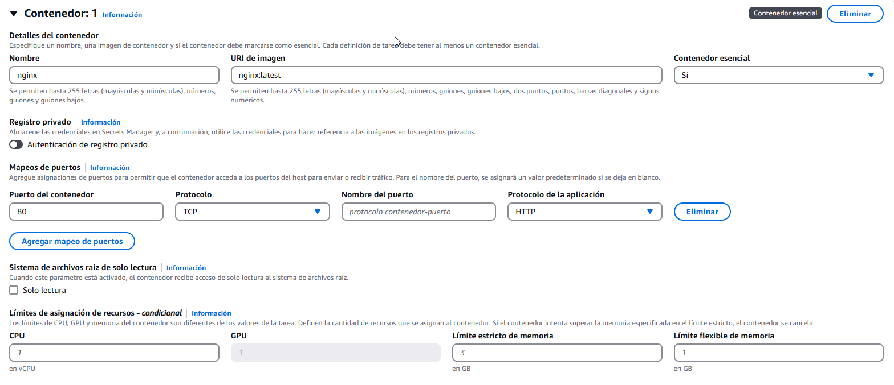

Por último, le ponemos la etiqueta que queramos para identificarla, aunque no es esencial. Y le damos a crear. Ya tenemos nuestra tarea definida y lista para usarla.

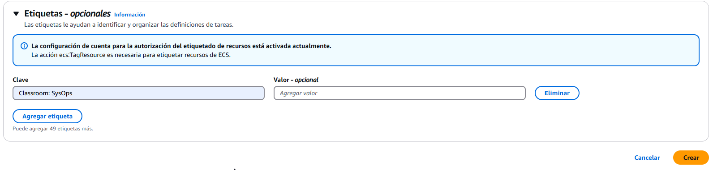

### Creación del servicio

Ahora que tenemos las instrucciones de ejecución, necesitamos saber la metodología para aplicarlas, ¿cuando queremos ejecutar estas instrucciones? Para eso sirve el servicio. Para crearlo, seleccionamos nuestro clúster, y en la pestaña de servicios le damos a crear.

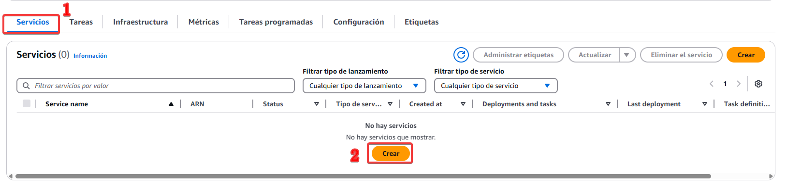

Como ya tenemos el clúster seleccionado, no nos dejará cambiarlo. En la configuración informática, para este caso más simple, vamos a elegir "Tipo de lanzamiento". La estrategia sirve para distribuir las tareas entre varios proveedores, nos puede interesar para elegir un determinado spot en caso de que haya demasiada demanda, y que use Fargate On Demand. Dejamos el resto de opciones por defecto.

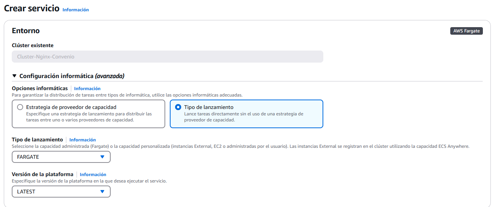

En configuración de implementación, tenemos que seleccionar la familia de definición de tareas, que es lo que hemos hecho en el paso anterior. La revisión de definición es que siempre usará la versión más reciente de las tareas que hemos creado, en el caso de que haya modificaciones.

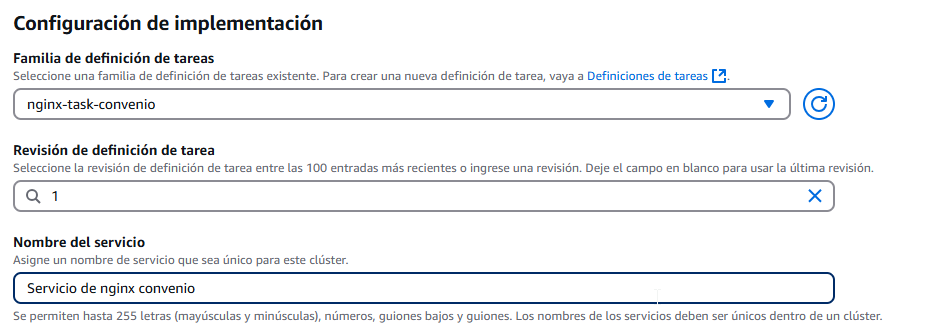

En la siguiente parte, no vamos a cambiar nada. El tipo de servicio es el único que nos deja por ahora, que es una réplica, creará réplicas exactas, tantas como necesite. En nuestro caso, creará una tarea porque es lo que le especificamos, no nos hace falta más. Se puede reequilibrar las tareas en todas las zonas de disponibilidad, dependiendo de la configuración de nuestra VPC. El periodo de gracia es una opción en la que podemos asignarle un tiempo de gracia a un servicio que da un error, y que en ese tiempo, se arregle o se levante automáticamente por él mismo. Si lo dejamos a cero, no le concederá nada de tiempo y detendrá la tarea al instante al ser detectado el error o problema.

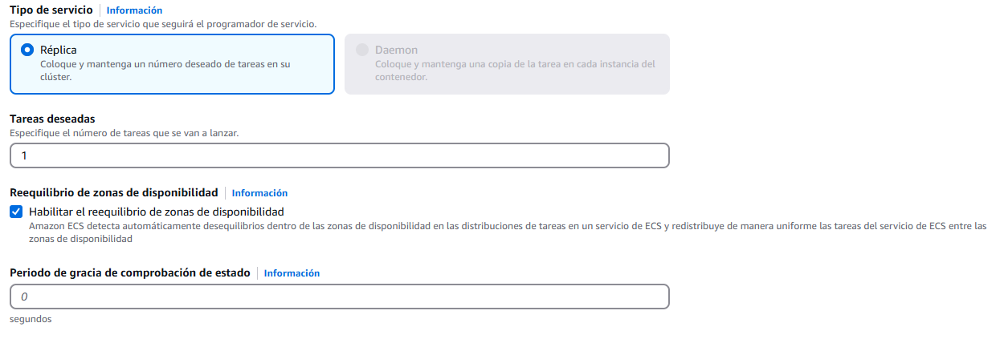

Por último, las redes. Seleccionamos la VPC, en mi caso uso la que cree en [pasos anteriores](instalacionVPC.md). Podemos seleccionar cuantas subredes usar, yo lo he dejado con todas, aunque no creo que sea realmente lo más eficiente. Además, usaremos un grupo de seguridad que hemos creado especificamente para esto, uno que permite la entrada por HTTP y HTTPS. Y por supuesto, activamos la IP pública para poder acceder a Nginx desde nuestro navegador.

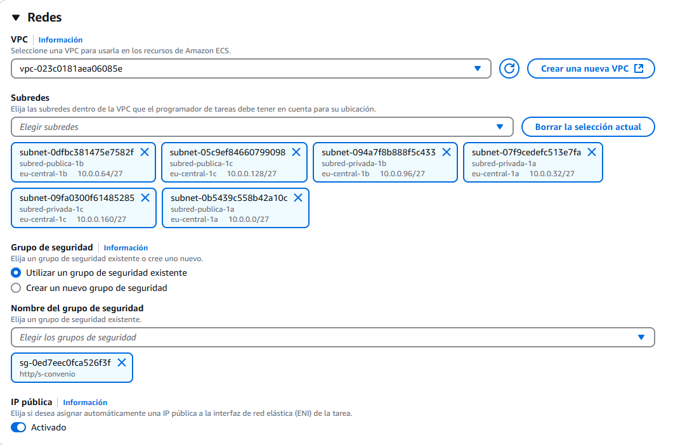

Tras configurarlo todo, le damos a crear...

Y vemos como en nuestro clúster aparece una parte de tareas, donde nos aparecerá que hay una pendiente.

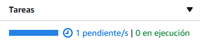

En cuestión de segundos, deberíamos ver como pasa de pendiente a en ejecución.

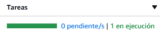

Y si está en ejecución, deberíamos poder acceder a Nginx a través del navegador por su IP pública:

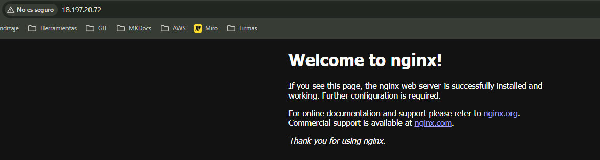

¡Listo! Ya tenemos nuestro Nginx dockerizado funcionando de manera pública, de manera serverless, a través de AWS.