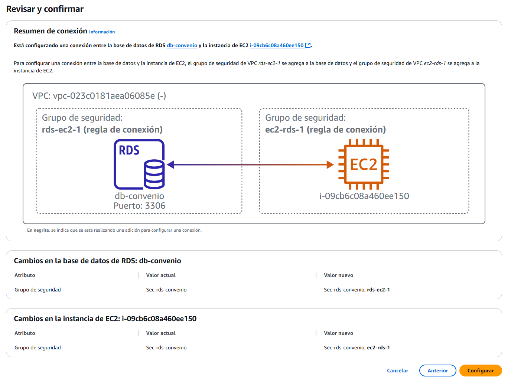
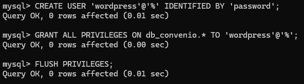

# Creación de RDS y conexión
Con RDS podemos tener una base de datos y conectarla a diferentes servicios de AWS directamente. Para esta práctica, creamos un RDS con MySQL, con seguridad en la autenticación y además conectamos a ella un EC2 para comprobar la conexión.

### Creando el RDS

En AWS, vamos a usar "Aurora and RDS" para esta base de datos. Accedemos a la sección mencionada y le damos a crear base de datos. 

Los primeros pasos nos dan a elegir si queremos una creación estándar o sencilla. Como queremos cambiar algunas cosas en la seguridad de la base de datos, vamos a elegir la estándar. En opciones del motor, es a elección y necesidad, para este caso vamos a usar MYSQL.

Podemos elegir el tipo de plantilla que se adapta según el uso, para producción, desarrollo... en esta práctica no nos interesa nada de eso, pero está bien saber que existe. Elegimos la capa gratuita y solo nos dará una opción en disponibilidad y durabilidad al seleccionar esta capa. Esto es básicamente que se creará una sola instancia principal y no se tendrá en cuenta ni redundancia de datos, ni puntos de conexión en otras zonas disponibles. Es la más básica.

Le indicamos un nombre a la instancia. Lo siguiente son las credenciales, donde debemos poner un nombre de usuario maestro, aquí lo he dejado en "admin" ya que es una de prueba pero no es la mejor práctica en términos de seguridad. En la administración de credenciales, vamos a usar AWS Secrets Manager. Es un servicio que proporciona AWS, que gestiona las contraseñas y los usuarios en forma de "secretos", ya que genera las contraseñas de manera automática y se van generando nuevas contraseñas según se configure el secret manager. La clave de cifrado que escogemos es la predeterminada.

La configuración de la instancia siempre se ciñe a nuestras necesidades. En este caso, escogí la más pequeña y más barata de todas.

El tipo de almacenamiento más de lo mismo que con el caso anterior. Lo dejé por defecto, ya que realmente no vamos a llenar esta base de datos.

Por ahora, no vamos a especificar la conexión a un EC2, ya que eso lo haremos más adelante. El tipo de red elegido es IPv4, aunque con modo de pila doble además de IPv4, se podría usar IPv6 también. Seleccionamos la VPC que tenemos creada, teniendo en cuenta que no podremos cambiarle el VPC una vez creada. Ya que estará en un VPC y haremos la conexión desde un EC2 que estará también en esa misma red, no queremos que tenga acceso público. 

Le vamos a crear un nuevo grupo de seguridad, aunque realmente podríamos elegir uno existente. Para este caso, prefiero tenerlo separado de lo demás.

Configuraciones adicionales, como el nombre. El grupo de parámentros de base de datos solo podremos usar el que viene por defecto, ya que no hay más opciones.

Le damos a crear cuando nos hemos asegurado de que tenemos todo correctamente. Veremos que nos llevará atrás y arriba nos saldrá el aviso de que se está creando. 

Si vamos al grupo de seguridad que se ha creado junto a la base de datos, podemos ver que se ha establecido directamente una regla de entrada en la que se puede acceder a la base de datos directamente desde nuestra IP personal. Aun así, como hemos visto en la creación del RDS, vamos a acceder a esta desde un EC2 que estará en el mismo VPC.

### Conectando un EC2 a RDS

Es muy sencillo y prácticamente lo hace todo AWS por ti. Tenemos que tener un EC2 listo, como ya vimos [anteriormente](instalacionEC2.md). Si vamos a la pestaña de "Conectividad y seguridad" de nuestro RDS, más abajo veremos la opción de recursos de computación conectados, que habrá ninguno. Le damos a configurar conexión de EC2.

Aquí, seleccionaremos directamente el EC2 que queremos conectar.

Se nos muestra qué es realmente lo que hará AWS para la conexión. Vemos que le va a crear un grupo de seguridad para el RDS y otro para el EC2. Dentro de estos nuevos grupos de seguridad, habrá una regla, en la que en el EC2 será de salida hacia el RDS, y en el RDS será de entrada para el EC2. 

!!! note "Recuerda"
    Para el EC2 debes poder conectar por SSH desde tu IP personal, así que debe estar así establecido en el grupo de seguridad de tu EC2. Esto es un error que yo mismo cometí, ya que olvidé establecerle una IP pública en este paso. La VPC a su vez debe tener una puerta de enlace para conectar con internet, si es totalmente interna no se podrá acceder tampoco a la EC2.

### Accediendo a RDS desde EC2

Ya tenemos conectado al EC2, pero antes de avanzar queremos saber cual será la contraseña de nuestro RDS, ya que ahora mismo no lo sabemos. Para esto, tenemos que ir a AWS Secrets Manager, que es el servicio que gestiona nuestras credenciales. Dentro, veremos la sección de secretos, donde nos saldrá nuestro secreto.

Después de acceder a nuestro secreto, veremos detalles de este. Más abajo, en la descripción general vemos la sección "valor del secreto", aquí es donde se muestran las credenciales que almacenamos. Si queremos verlas, le damos a recuperar valor del secreto y se nos mostrarán las credenciales. En este caso, el usuario que pusimos en la creación RDS y su contraseña.

Ahora podemos conectar a RDS desde nuestro EC2. Estando ya en el EC2 a través de SSH, conectamos al servidor con el primer comando que se ve en la captura. Nos pedirá la contraseña que copiamos desde el Secrets Manager y conectamos con RDS. 

Para comprobar que estamos conectados y realmente es funcional, podemos hacer un par de cosas. Aquí aproveché para crear un usuario que usaremos más adelante para conectar la base de datos con un ECS que contendrá un Wordpress.

Pero lo más importante es que ya tenemos nuestro RDS funcional, en su VPC, conectado a un EC2 y solo accesible por este. 