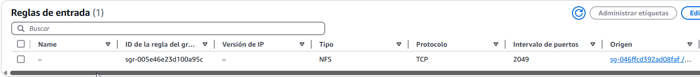

# Desplegar Wordpress con ECS, RDS, y EFS
Para esta práctica, vamos a usar todo lo aprendido anteriormente. Desplegar un Wordpress a través de ECS con Fargate no es tan sencillo como puede parecer al principio. Vamos además a usar Amazon EFS, un servicio dedicado al sistema de archivos que no será esencial para hacer funcional nuestro wordpress.

### Creación del EFS
La creación del EFS es extremadamente sencilla, ya que principalmente nos pedirá el nombre de esta y la VPC en la que vamos a trabajar. El punto más importante de esta, son los destinos de montaje y el punto de acceso. 

Primero, el punto de acceso. Esto nos servirá para indicarle al EFS la ruta donde se accede al contenedor y también el usuario con los permisos que tendrá. Esto quiere decir que le establecemos el usuario que creará y tendrá los permisos necesarios para la lectura y escritura de archivos. Así, en cada tarea nueva que se cree, se usará siempre al mismo usuario y podrá mantener los archivos de otras tareas, ya que nos aseguramos que siempre se ejecutará la misma ruta con el mismo usuario y los mismos permisos. 

A la hora de hacerlo, entonces, nos aseguramos cual es el ID de usuario que necesitamos. En este caso, al usar la imagen oficial de Wordpress, es el 82 (Así que esto es algo a tener en cuenta para otros proyectos) y le damos todos los permisos posibles. La ruta del directorio raíz es también la que necesitamos para Wordpress.


También vamos a necesitar los puntos de montaje. Nuestro ECS, así como la tarea, se puede desplegar en tres zonas de disponibilidad diferentes, que además cada una de ellas tienen tanto una subred pública como una privada. Si nuestro ECS puede desplegar Wordpress en cada una de las zonas (que es algo que definimos en la tarea), queremos hacer el punto de montaje en las subredes públicas de cada zona. Quedando algo así:


Como se ve en la captura de arriba, se tiene que establecer un grupo de seguridad para el EFS concretamente. Este grupo de seguridad solo tendrá una regla de entrada y otra de salida. La regla de salida aceptará todo el tráfico. En cuanto a la regla de entrada, se debe aceptar las conexiones tipo NFS (que es para el sistema de archivos) con puerto 2049, y de origen el grupo de seguridad que tiene establecido nuestra tarea.



### El JSON de la definición de tarea
Como ya vimos en [pasos anteriores](creacionECS.md/#definición-de-tarea) necesitamos una definición de tarea. Nos vamos a fijar en lo esencial, para empezar vamos a coger las credenciales del Secret Manager directamente en vez de poner en el JSON la contraseña y el usuario directamente. Esto, además de ser más seguro, se actualiza automáticamente si se cambian las credenciales en el secret manager. En estas credenciales, tenemos que incluir no solo la cuenta y contraseña para conectar a la base de datos RDS, si no que también vamos a añadir datos como el nombre de la base de datos y el host, ya que es esencial para poder conectar a la base de datos desde nuestra tarea. Este es el JSON resultante, cogiendo la ID del Secret Manager junto con el campo que nos interesa:


??? note "Permisos para ecsTaskExecutionRole"
    En IAM, necesitaremos una serie de permisos para trabajar siempre. Las tareas tienen su propio rol y también necesitan permisos para poder trabajar con otros servicios de AWS. Estos son los permisos que hacen falta para permitirle a la tarea que acceda a los datos del Secret Manager:

    ```bash
    "Version": "2012-10-17",
    "Statement": [
        {
            "Sid": "VisualEditor0",
            "Effect": "Allow",
            "Action": [
                "secretsmanager:GetSecretValue",
                "secretsmanager:DescribeSecret"
            ],
            "Resource": "arn:aws:secretsmanager:eu-central-1:414131675413:secret:SecretWordpress-MRSCvF"
        }
    ]
    ```

Además, ahora que tenemos nuestro EFS preparado, tenemos que definir algunas cosas más para conectarlos. Como se ve en la captura de más abajo, en la etiqueta de los volúmenes está el nombre de nuestro EFS, el ID y también el ID del punto de acceso que hemos creado. Con esto, será suficiente para hacerlo funcional.


??? note "Permisos para ecsTaskExecutionRole"
    Al igual que con los permisos para el Secret Manager, también debemos hacer que el rol de ejecución de tareas pueda acceder al EFS. Esto es lo que debemos incluir al JSON de EcsTaskExecutionRole para hacerlo funcional:

    ```bash
    "Version": "2012-10-17",
    "Statement": [
        {
            "Effect": "Allow",
            "Action": [
                "elasticfilesystem:ClientMount",
                "elasticfilesystem:ClientWrite"
            ],
            "Resource": "arn:aws:elasticfilesystem:eu-central-1:414131675413:file-system/*"
        }
    ]
    ```

??? abstract "JSON completo"
    ```bash
    "taskDefinitionArn": "arn:aws:ecs:eu-central-1:414131675413:task-definition/wordpress-convenio:15",
    "containerDefinitions": [
        {
            "name": "wordpress",
            "image": "wordpress:latest",
            "cpu": 0,
            "portMappings": [
                {
                    "name": "wordpress-80-tcp",
                    "containerPort": 80,
                    "hostPort": 80,
                    "protocol": "tcp",
                    "appProtocol": "http"
                }
            ],
            "essential": true,
            "environment": [],
            "mountPoints": [
                {
                    "sourceVolume": "Wordpress-convenio",
                    "containerPath": "/var/www/html",
                    "readOnly": false
                }
            ],
            "volumesFrom": [],
            "secrets": [
                {
                    "name": "WORDPRESS_DB_HOST",
                    "valueFrom": "arn:aws:secretsmanager:eu-central-1:414131675413:secret:SecretWordpress-MRSCvF:host::"
                },
                {
                    "name": "WORDPRESS_DB_NAME",
                    "valueFrom": "arn:aws:secretsmanager:eu-central-1:414131675413:secret:SecretWordpress-MRSCvF:dbname::"
                },
                {
                    "name": "WORDPRESS_DB_PASSWORD",
                    "valueFrom": "arn:aws:secretsmanager:eu-central-1:414131675413:secret:SecretWordpress-MRSCvF:password::"
                },
                {
                    "name": "WORDPRESS_DB_USER",
                    "valueFrom": "arn:aws:secretsmanager:eu-central-1:414131675413:secret:SecretWordpress-MRSCvF:username::"
                }
            ],
            "logConfiguration": {
                "logDriver": "awslogs",
                "options": {
                    "awslogs-group": "/ecs/wordpress-convenio",
                    "mode": "non-blocking",
                    "awslogs-create-group": "true",
                    "max-buffer-size": "25m",
                    "awslogs-region": "eu-central-1",
                    "awslogs-stream-prefix": "ecs"
                },
                "secretOptions": []
            },
            "systemControls": []
        }
    ],
    "family": "wordpress-convenio",
    "executionRoleArn": "arn:aws:iam::414131675413:role/ecsTaskExecutionRole",
    "networkMode": "awsvpc",
    "revision": 15,
    "volumes": [
        {
            "name": "Wordpress-convenio",
            "efsVolumeConfiguration": {
                "fileSystemId": "fs-0b146aa6600282f06",
                "rootDirectory": "/",
                "transitEncryption": "ENABLED",
                "transitEncryptionPort": 2049,
                "authorizationConfig": {
                    "accessPointId": "fsap-0bc49861ed8b2aaa1",
                    "iam": "DISABLED"
                }
            }
        }
    ],
    "status": "ACTIVE",
    "requiresAttributes": [
        {
            "name": "com.amazonaws.ecs.capability.logging-driver.awslogs"
        },
        {
            "name": "ecs.capability.execution-role-awslogs"
        },
        {
            "name": "ecs.capability.efsAuth"
        },
        {
            "name": "com.amazonaws.ecs.capability.docker-remote-api.1.19"
        },
        {
            "name": "ecs.capability.secrets.asm.environment-variables"
        },
        {
            "name": "ecs.capability.efs"
        },
        {
            "name": "com.amazonaws.ecs.capability.docker-remote-api.1.28"
        },
        {
            "name": "com.amazonaws.ecs.capability.docker-remote-api.1.25"
        },
        {
            "name": "com.amazonaws.ecs.capability.docker-remote-api.1.18"
        },
        {
            "name": "ecs.capability.task-eni"
        },
        {
            "name": "com.amazonaws.ecs.capability.docker-remote-api.1.29"
        }
    ],
    "placementConstraints": [],
    "compatibilities": [
        "EC2",
        "FARGATE"
    ],
    "requiresCompatibilities": [
        "FARGATE"
    ],
    "cpu": "1024",
    "memory": "3072",
    "runtimePlatform": {
        "cpuArchitecture": "X86_64",
        "operatingSystemFamily": "LINUX"
    },
    "registeredAt": "2025-04-28T09:00:39.363Z",
    "registeredBy": "arn:aws:iam::414131675413:user/onisim.iacob",
    "enableFaultInjection": false,
    "tags": []
    ```


También tenemos que definir el grupo de seguridad exclusivo para nuestra tarea. Así es como la he definido yo, y así es como la muestro, aunque diría que hay reglas que sobran. Por ejemplo, no tiene sentido aceptar HTTPS si no está todo configurado para hacerlo funcional. Tampoco creo que sea necesario aceptar IPv6 ni todo el tráfico general. Aún así, como hice tantas pruebas con esto, así es como ha funcionado, no está mal, pero podría estar más limpio, así que es algo a tener en cuenta.


### Otras configuraciones
#### Crear usuario para Wordpress
Como he dicho más arriba, hace falta un usuario para acceder a Wordpress. Siempre tenemos que usar el mismo para evitar problemas, así que creamos uno en la base de datos. Esto realmente [ya lo hemos visto](creacionRDS.md/#accediendo-a-rds-desde-ec2) así que si hay dudas aconsejo leer el enlace entero. Aquí tenemos configurado el bastión EC2 por el que hay que conectar para tratar la base de datos. Creamos el usuario:


#### Crear el Secrets Manager
Ya vimos también [como trabajar con Secrets Manager](creacionRDS.md/#accediendo-a-rds-desde-ec2). Esta vez lo tendremos creado por nosotros mismos. Como hemos visto en el segundo paso de esta documentación, tenemos que tener controladas la clave del secreto y su valor, ya que será lo que se usará desde el JSON de la definición de tarea. Es muy sencillo, ya que lo más importante es el username, la password, el host y la dbname:

