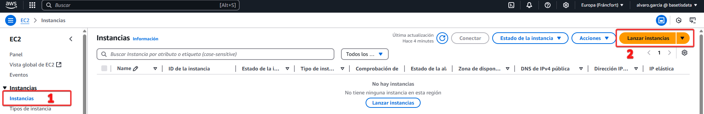
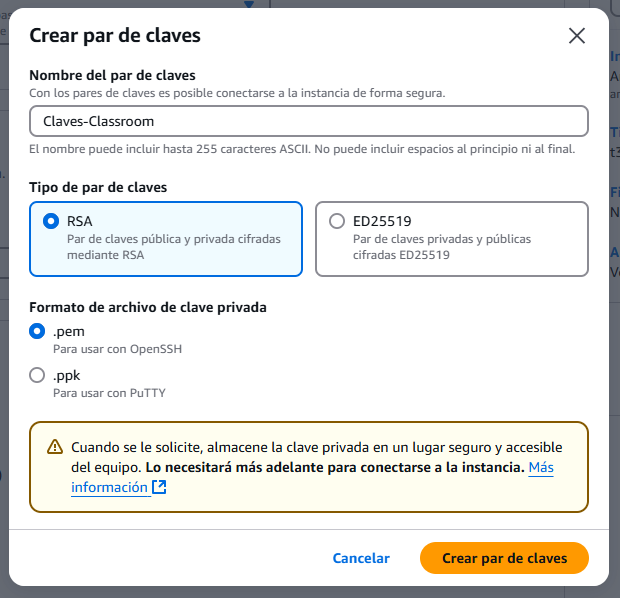
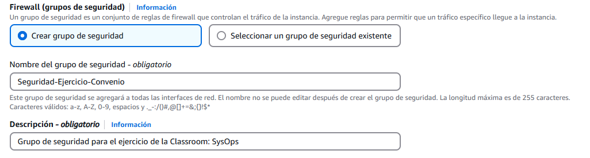

## Creación y puesta en marcha de EC2

Necesitamos una máquina EC2 para muchas cosas, para albergar un servidor web, por ejemplo. Para este ejemplo, la necesitaba para instalar un Nginx. Antes de ello, cree una VPC con sus subredes. 

[:tools: Creación y puesta en marcha de VPC y sus subredes :tools:](instalacionVPC.md){ .md-button }

### Creación de la EC2

Para crear nuestra EC2, nos logueamos en nuestra cuenta y vamos al servicio de EC2. Una vez ahí, debemos ir a las instancias en el menú de la izquierda y seleccionar "Lanzar instancias"

Se nos abrirá una página con mucha información, así que vamos paso a paso. Lo primero es establecer un nombre para la EC2 y ponerle las etiquetas que nos hagan falta. En mi caso, le puse el nombre a la EC2 y avancé.

Más abajo, es donde elegiremos la AMI. Para este ejemplo, selecioné un SO liviano y rápido, un Amazon Linux 2. Aquí depende de lo que necesitemos hacer. 

Después nos encontramos con el tipo de instancia. Aquí debemos tener cuidado (1) ya que este es el hardware que usará nuestra máquina EC2. En mi caso he escogido una de las más simples y baratas, pero que es más que suficiente para lo que voy a usarla.
{ .annotate }

1.  :link: Dejo aquí un enlace de interés para comparar rápidamente instancias y encontrar la que nos interese :link: https://instances.vantage.sh/

A continuación, tenemos el par de claves...

!!! Failure "Los pares de clave son... clave... :drum:ba dum tss:drum:"

    En la siguiente captura muestro lo que ==NO== hay que hacer. Si queremos usar una conexión SSH, necesitaremos un par de claves. Además, es mejor siempre crearlas por si acaso, ya que no sabemos cuando la podremos necesitar.

Para evitar esto, no debemos seleccionar la opción que muestro arriba. Debemos hacer lo que muestro en las dos siguientes imágenes:

Continuando, haremos el paso más importante, que aquí ya tenemos los pasos previos configurados, si no hay que hacer lo que indico [aquí](instalacionVPC.md). Vamos a seleccionar la VPC que queremos usar, además de la subred. En este caso quiero que la EC2 sea pública, así que escojo la subred pública que configuré en pasos anteriores. Además, ya que como quiero que sea pública, habilito la opción "Asignar automáticamente la IP pública". 

Después de esto, necesitaremos un grupo de seguridad para controlar la entrada a la máquina. Como no tenemos ninguno hecho, dejamos marcada la opción de crear un grupo de seguridad, le ponemos un nombre y una descripción...

Y después añadimos las reglas deseadas. Aquí, yo configuro las reglas para que solo se pueda acceder a la máquina por SSH a través de mi IP pública. También configuro la máquina para que se pueda conectar a esta a través del puerto 80 HTTP, para todo internet.

Por último, vemos el resumen para asegurarnos de que está todo tal y como lo necesitamos.

Tras hacer clic en "Lanzar instancia", ya tendremos nuestra máquina EC2 lanzada y lista para trabajar con ella. :muscle_tone1:

### Conexión a la EC2

Ahora solo falta conectar a la máquina a través de SSH para comprobar su funcionamiento. Tenemos que seleccionar nuestra máquina, y una vez hecho, le damos a conectar.

Vamos a la pestaña de Cliente SSH. Aquí vemos las instrucciones que debemos seguir para conectar a la máquina.

En mi caso, lo hice a través de un CMD de Windows. Aquí podemos ver como la conexión fue correcta y funcional.

¡Listo!