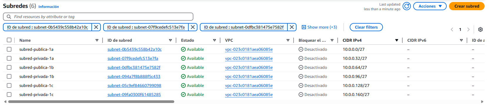

# :material-tools: Creación de una VPC y sus subredes
Con una VPC, podemos tener nuestra red virtual privada y las subredes que necesitemos dentro de ella. En AWS se pueden crear y podemos generar subredes en las zonas de disponibilidad que tenemos en cada región. 

## Cómo crear una VPC
Una vez estamos dentro de nuestra cuenta de AWS, buscamos el servicio VPC.

Cuando estamos dentro de VPC, veremos un botón naranja, le hacemos clic para entrar al menú de creación

A la hora de crear la VPC, necesitamos saber cual será el CIDR que usaremos. En este caso uso el 10.0.0.0/24, aunque las subredes tendrán pocas IPs disponibles, para esto caso está bien. Si queremos más IP en las subredes, deberíamos poner por ejemplo un /16.

Por último, tenemos que añadirle una etiqueta para identificar más fácilmente más adelante el recurso. Después, le damos a crear VPC.

Ya tenemos nuestra VPC creada :material-party-popper:

Este es el resultado

## Creación de las subredes :material-web-box:

Ahora que tenemos nuestra VPC lista para trabajar con ella, vamos a crear las subredes que necesitamos. Para este caso, necesitamos seis subredes. En cada zona, vamos a crear una pública y otra privada. Para empezar, vamos a subredes...

Le damos al botón naranja de crear subred y nos aparecerá la siguiente página. Lo primero que haremos, será seleccionar la VPC que hemos creado como muestro a continuación.

Después de asegurarnos que es la VPC correcta, si bajamos vemos la opción de crear la subred. Aquí, crearemos tantas como necesitemos. Os muestro como crear la primera, ya que luego el único cambio a hacer es cambiar el CIDR, que es la IP que albergará cada subred.

!!! warning "Cuidado con las CIDR"

    Asegurate de poner correctamente la IP de cada subred, esto es lo más importante. AWS te avisará solamente si hay un conflicto con la IP, pero asegúrate de ponerlas bien ya que puedes dejar menos IP por subred de las que deseas. A la hora de poner el bloque de CIDR de la subred, fíjate como a la derecha indica las IPs que ofrece la IP que has colocado.

Cuando crees todas las subredes, este será el resultado. Ya están listas las subredes, ya puedes seguir configurándolas tal y como necesites. 

## Crear una puerta de enlace

!!! info "Cuidado con el idioma"

    No confundir Puerta de enlace de internet con Gateway NAT. En la versión en castellano puede ser un poco confuso.

Necesitamos una puerta de enlace para nuesta VPC, ya que sin ella, no vamos a poder salir a internet con las subredes públicas. Para ello, en el servicio de VPC, vamos a las opciones de Puerta de enlance de internet.

Crearla es tan sencillo como se muestra en la imagen. Tenemos que especificar el nombre y ponerle las etiquetas que necesitemos poner, tan fácil como eso.

Una vez creada, debemos enlazarla con nuestra VPC.

Con esto ya tenemos lista la puerta de enlace para las subredes que lo necesiten.

## Editar tabla de enrutamiento

Para hacer que una subred sea pública, tenemos que editar su tabla de enrutamiento y añadir la puerta de enlace que hemos creado anteriormente. Vamos a la subred que vamos a usar, la seleccionamos y en detalles, bajamos hasta encontrar tabla de enrutamiento, donde clicamos para entrar en sus opciones.

Nos saldrá la tabla de enrutamiento asignada a esa subred. En la pestaña de rutas, tras seleccionarla, vamos a editar las rutas.

Aquí, vamos a añadir una nueva ruta. Queremos que esta subred sea pública, así que le vamos a asignar 0.0.0.0/0 (todas las redes, osease, internet) y el destino será la puerta de enlace que creamos antes. Seleccionamos esta y le damos a guardar cambios.

Con todo esto, ya tenemos nuestra VPC configurada y la subred preparada para funcionar a nivel de internet. 