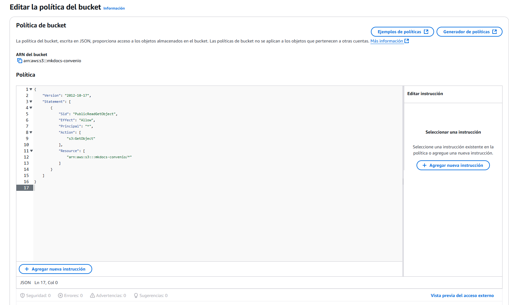

# Creación de un bucket S3, y desplegar web estática
Con S3 podemos tener archivos guardados en lo que se conoce como un "bucket", al que otros servicios de AWS pueden acceder para usarlos y así evitar el uso de espacio en discos, teniéndolo siempre disponible pero ahorrando espacio al mismo tiempo. Una de las opciones que tenemos con S3, es poder desplegar una web estática al subir sus contenidos al bucket. 

### Creando el bucket
Para empezar, lo primero que hacemos es ir como siempre al servicio de S3 de AWS. Nos aparecerá una página informativa sobre los usos de S3, consejos, etc... le damos al botón de crear bucket.


Veremos nada más entrar en la configuración, que lo primero es ponerle un nombre a nuestro bucket. No tiene misterio alguno, le ponemos el nombre que deseamos.


Bajando por la configuración, nos encontraremos con la "configuración de bloqueo de acceso público...", que estará marcado por defecto. Desmarcamos todas las opciones, ya que nosotros queremos que sea público. Además nos saldrá un campo en el que debemos reconocer los riesgos que esto conlleva. 


??? note "¿Por qué es un riesgo?"
    Los riesgos de tener públicamente un S3, principalmente, es porque se puede usar de manera nociva para hacer daño. Por ejemplo, en este caso, tenemos bastantes imágenes en la página estática, por lo que si alguien decide hacer muchas peticiones a nuestra web estática, y descargar muchas veces las imágenes, el coste del S3 se disparará haciendo que tengamos que pagar cantidades desorbitadas. Puede haber más riesgos, pero este es el más común.

Al tenerlo todo configurado ya, le podemos dar a crear. Nos saldrá arriba un mensaje en verde si todo está bien, informándonos de que para cargar archivos tenemos que darle a "Ver detalles", así que le damos.


### Subir archivos al bucket
Al entrar en la configuración del bucket que hemos creado, lo primero que veremos será la pestaña "objetos", que estará marcada por defecto. Ahí, podemos darle a cargar para subir los archivos que queremos. Para este caso subí esta misma web, la documentación entera.


Podemos darle a agregar carpeta si queremos subirlo todo de golpe en una sola carpeta.


Al subirlo, veremos un resumen de los archivos que hemos subido, su tamaño, el número de archivos, el tipo, etc. Cuando estemos seguros de esto, le damos a cargar.


??? warning "¡Cuidado!"
    Al subir una carpeta entera, se guarda también la estructura de las carpetas, por lo que tenemos que tener en cuenta que el index.html no estará directamente en la raíz, si no detrás de la carpeta site en este caso. Para arreglar esto, simplemente hay que subir todos los archivos arrastrándolos sobre la subida, para que la raíz sea directamente donde se encuentra el index.html. Si no, también lo podemos especificar en la configuración de la página estática

### Configurar alojamiento estático
Ya tenemos listo nuestros contenidos, así que ahora vamos a configurar el bucket para que lo haga una web estática. En las pestañas de configuración, vamos a propiedades...


En las opciones, veremos una concreta para el alojamiento de sitios estáticos. Le damos a editar, ya que estará deshabilitada por defecto.


Habilitamos el alojamiento y lo demás lo dejamos por defecto. Lo único que cambiaremos, será el documento de índice, que será el archivo que servirá de index para nuestra web. Esto es lo que comentaba en el aviso anterior, aquí tenemos que asegurarnos que el nombre y la ruta son correctas. En el ejemplo de la captura, pongo el index ya que yo lo tengo en la raíz del bucket. 


### Conectando a la web

Ahora que ya tenemos configurado todo, sí que podemos entrar a nuestra web. Así que cogemos el enlace que nos ofrece el bucket al tener habilitada la web estática. Entramos en el enlace y...


Error, ya que nos falta algo más por hacer. A pesar de haber quitado la configuración de bloqueo, aún falta por agregarle una política al bucket, ya que es 100% necesario. Volvemos a la configuración del bucket, y vamos a permisos. Ahí nos aparecerá la política del bucket, le damos a editar.


Aquí añadimos la política en JSON. En esta política, podemos ver que se permite la lectura pública y el get para los objetos que hay en el bucket. Básicamente esto quiere decir que cualquier persona con internet podrá descargar los archivos que están en el bucket a través de la URL para poder visitar la web estática. 



??? note "JSON"
    ```bash
    
    "Version": "2012-10-17",
    "Statement": [
        {
            "Sid": "PublicReadGetObject",
            "Effect": "Allow",
            "Principal": "*",
            "Action": "s3:GetObject",
            "Resource": "arn:aws:s3:::mkdocs-convenio/*"
        }
    ]

    ```

Ahora, si recargamos la web, vemos que debería cargar correctamente.


¡Y ya estaría! 