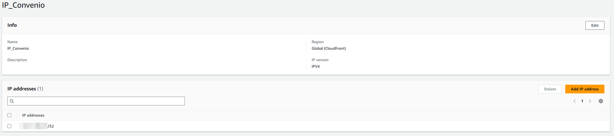
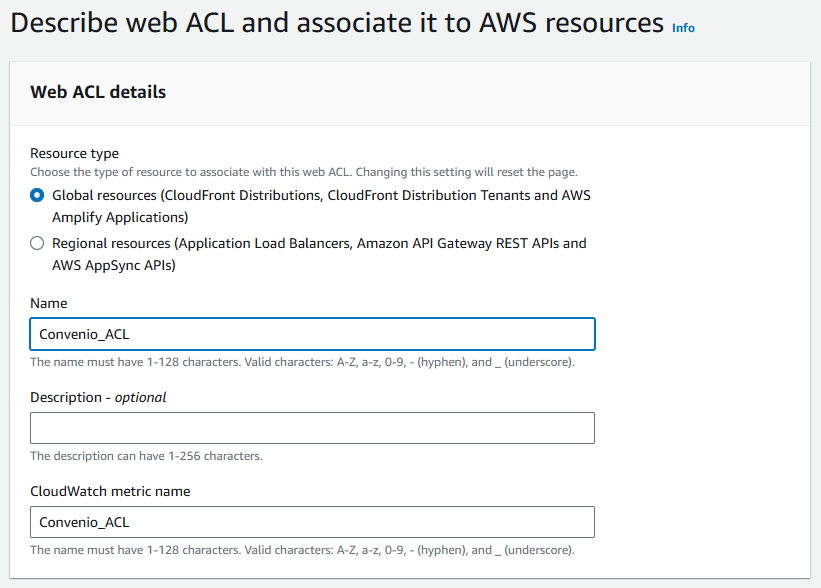
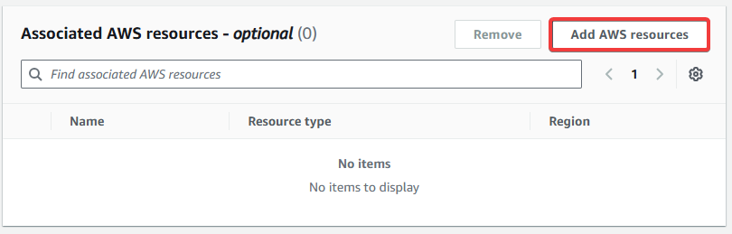
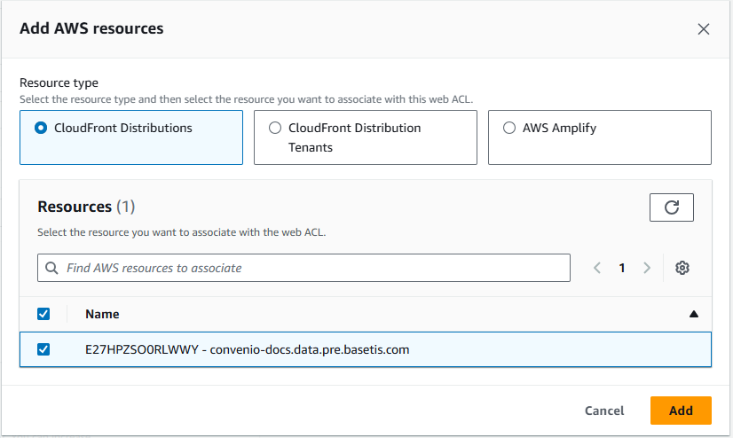
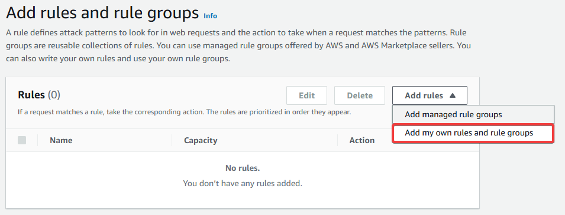
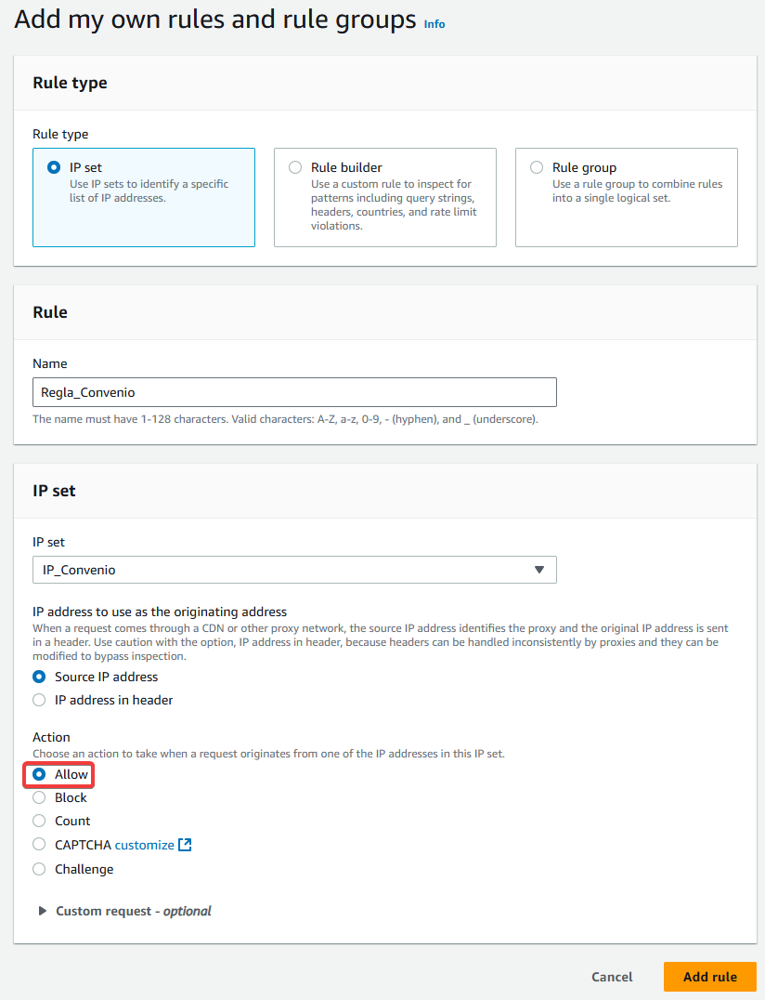
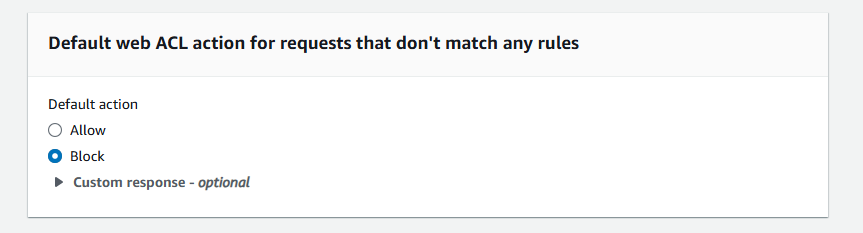
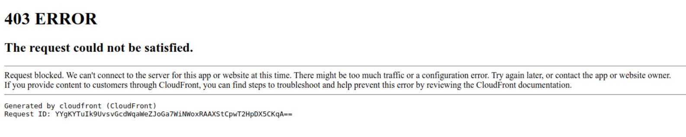

# Limitar conexiones con WAF
En este ejemplo, voy a crear una ACL para darle acceso solamente a una única IP y limitar todas las demás. Esto sirve por ejemplo para limitar el acceso a nuestra web a la VPN de nuestra empresa, nuestra IP solamente, o un set de IPs. 

Lo primero que debemos hacer es crear un IP set en WAF & Shield. Este IP set es la IP o agrupación de estas con las que queremos trabajar. Para este ejemplo, yo he usado mi IP personal. Se nos pide el nombre, la región, la versión de IP y también las IP. En este caso, yo quiero usarlo en mi web estática, que está en un S3 con CloudFront, así que la región tiene que ser Global (CloudFront), será versión IPv4 y luego efectivamente mi IP personal.

Ahora que tenemos nuestro IP set, vamos a crear la ACL para hacer que solo esta IP pueda acceder a la página web. Vamos a Web ACLs y le damos a crear una nueva. Nada más empezar, se nos pedirá el resource type, aquí tenemos que elegir lo que se amolde a nuestra necesidad, en este caso es un CloudFront, así que es un recurso global.

Después, aunque diga que es opcional, debemos seleccionar el recurso directo al que le queremos aplicar la ACL. Así que le damos a añadir AWS resources y seleccionamos nuestro CloudFront.

Le damos a continuar y llegaremos al paso dos. Aquí tenemos que seleccionar una regla para la lista, donde se define como trabajará. Vamos a crear nuestra propia regla, ya que nos interesa especificar lo que queremos hacer con el IP set que hicimos antes. 

Aquí le vamos a poner un nombre a la regla y luego seleccionamos nuestra IP set que hemos hecho anteriormente. Y ahora, lo más importante, en "Action" seleccionamos "Allow" ya que queremos que se permita el acceso a nuestra IP, no bloquearlo. Una vez hecho, añadimos la regla.

Vamos a ver nada más añadir la regla, que tenemos el cuadro "Default web ACL action for requests that don't match any rules", es decir, qué hara con las IP que no estén en el IP set que le hemos asignado. Como queremos hacer una especie de VPN, queremos que solo se admita nuestra IP personal, así que marcamos la opción block.

Le damos a continuar. Veremos que el paso tres es elegir la prioridad de las reglas. Como solo tenemos una regla, le damos a continuar. El resto de pasos, son configuraciones de las métricas de CloudWatch y luego un resumen de todo lo que hemos hecho. Lo dejamos todo por defecto y creamos nuestra ACL.

Ahora que ya la tenemos creada, es hora de comprobar si de verdad funciona. Si lo pruebas desde tu propia IP, debería funcionar como siempre. Pero si entras desde otra IP, debería aparecer algo así:

Como se puede ver en la captura de arriba, se bloquea directamente el request y no se da información específica del por qué. Con esto, ya sabemos que tenemos nuestro CloudFront bloqueado para IPs externas a nuestro IP set.
